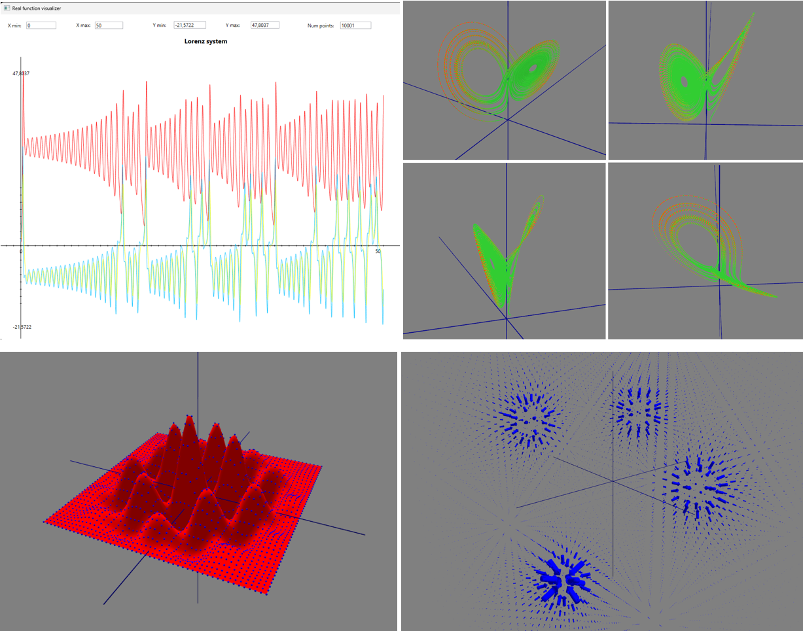
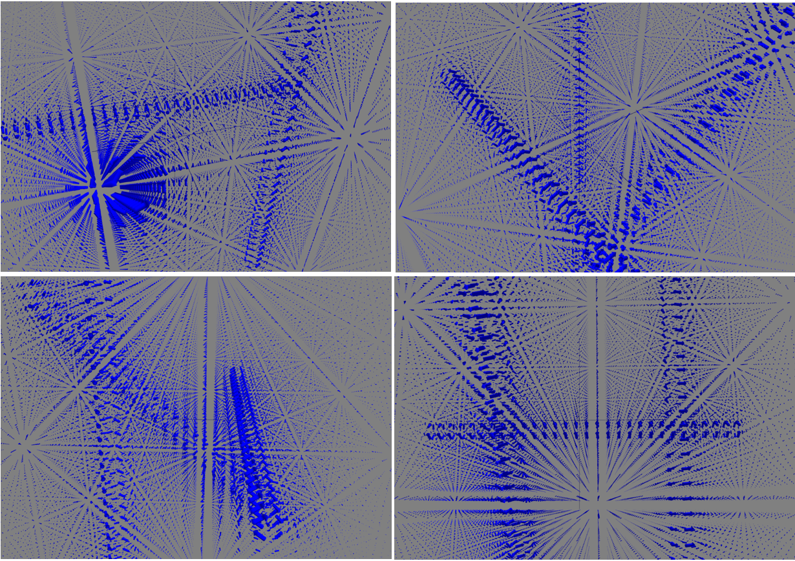

# MML - Minimal Math Library
All your basic (numerical) math needs, contained in a single-header file.

**MML Vision**
- For a C++ developer, on Windows, Mac or Linux
- Who needs a math library to perform simple (and not so simple) numerical calculations 
- The Minimal Math Library is a general purpose, pythonesque and easy to use single-header C++ library of classes and functions
- That is trivial to use in any kind of project, is C++ 20 cross-platform compatible, and comes with a rich set of functionalities for working with vectors, matrices, tensors, polynoms, real, scalar and vector functions, linear systems, differential equations, coordinate systems and transformations, with algorithms for derivation, integration, root finding, interpolation, optimization, statistics, and more.

**Basic facts**
- As of now, and for foreseable future, this is unfortunately strictly for personal, research and educational use only (see Licensing at the end)
- Single-header  - get MML.h, include in your project and go 
- Cross-platform - tested with Visual Studio Code on Windows (MSVC++, clang), Mac (gcc, clang), Linux (gcc)
- C++20 standard - but can easily be adapted to C++17, C++14
- Pythonesque in its focus on simplicity of use, and focused on faithful modeling of mathematical entities (while trying as much as possible to retain C++ computational efficiency)

**Is there really a need for another C++ math library?**
- Main benefit, and the reason I did all this is attempt at completeness, and simplicity of use
- Not hard focused on efficiency so when going gets rough - Boost, Eigen, Armadillo, etc.

**Organization**

Library is organized in three main groups (you could call them layers), with addition of visualizers as external tools.

***Base***

Basic math types. These are the building blocks of the library, sitting at the lowest layer, depending only on standard library headers (and possibly Vector and Matrix class), and are used in all other parts of the library. 
- [Algebra](/docs/base/Algebra.md) - groups, permutation group (big TODO!)
- [Vectors](/docs/base/Vector_types.md) - Vector, VectorN<int N>, Vector(2)(3)Cartesian, Vector2Polar, Vector3Spherical, Vector3Cylindrical
- [Matrices](/docs/base/Matrix_types.md) - Matrix, MatrixNM<int N, int M>, MatrixSym, MatrixTridiag, MatrixBandDiag
- [Tensors](/docs/base/Tensors.md) - Tensor2<int Dim>, Tensor3<int Dim>, Tensor4<int Dim>, Tensor5<int Dim> in N dimensions
- [Polynoms](/docs/base/Polynom.md) - general Polynom class (tested for Real, Complex and Matrix as field type)
- [Geometry](/docs/base/Geometry.md) - pure geometry: points, triangles, bodies
- [2D & 3D geometry](/docs/base/Geometry_2D_3D.md) - analytic geometry in 2D and 3D
- [Vector spaces](/docs/base/Vector_spaces.md) - vector space, normed vector space, metric (Hilbert) space (still much to do here!)
- [Operators](/docs/base/Operators.md)  - linear functional, quadratic form, linear operator (much to do here!)
- [Base utils](/docs/base/BaseUtils.md) - general utilities including matrix helper (IsOrthogonal, IsUnitary, IsHermitian)

***Core***

Core mathematical objects and operations. These are the core of the library, depending on Base types, and used by algorithms.
- [Linear alg. equations solvers](/docs/core/Linear_equations_solvers.md) - GJ, LU, QR, SVD, Cholesky
- [Matrix utils](/docs/core/MatrixUtils.md) - general matrix utilities 
- [Functions](/docs/core/Function_types.md) - IRealFunction, IScalarFunction<int N>, IVectorFunction<int N>, IParametricCurve<N>, IParametricSurface<N>, ITensorField<N>
- [Interpolated functions](/docs/core/Interpolated_functions.md) - linear, polynomial, rational polynomial, spline interpolations
- [Numerical derivation](/docs/core/Derivation.md) - orders 1, 2, 4, 6, 8 for IRealFunction, IScalarFunction, IVectorFunction, IParametricCurve, IParametricSurface, ITensorField
- [Numerical integration](/docs/core/Integration.md) - Trapezoidal, Simpson, Romberg basic integration algorithms
- [Field operations](/docs/core/Vector_field_operations.md) - grad, div, curl, Laplacian in general, Cartesian, cylindrical and spherical coordinates
- [Metric tensor](/docs/core/Metric_tensor.md) - predefined metric tensors in General, Cartesian, Cylindrical and Spherical coordinates
- [Coordinate transformations](/docs/core/Coordinate_transformations.md) - General, Cartesian, Cylindrical, Spherical  
- [Curves & Surfaces](/docs/basic_types/Curves_and_surfaces.md) - predefined curves and surfaces
- [Dirac delta function](/docs/basic_types/Dirac_delta_function.md)- predefined distributions for representing Dirac delta function
- [Fields](/docs/basic_types/Fields.md) - predefined example fields
- [Standard functions](/docs/basic_types/Functions.md) - definition of available standard functions
- [Function spaces](/docs/basic_types/Function_spaces.md) - Hermitian, Legendre, Laguerre, Chebyshev, Fourier spaces
- [ODE system](/docs/basic_types/ODE_system.md) - represents a dynamical system of ordinary differential equations

***Algorithms***

Algorithms for solving mathematical problems. These are the algorithms of the library, depending on Base and Core types.
- [Eigen solvers](/docs/algorithms/Eigen_solvers.md) - solving eigenvalue problems for symmetric and non-symmetric real matrices
- [ODE system solvers](/docs/algorithms/Differential_equations_solvers.md) - solvers for systems of ordinary differential equations
- [Differential geometry](/docs/algorithms/Differential_geometry.md) - for curves only, so far
- [Path integration](/docs/algorithms/Path_integration.md) - calculating line and work integrals
- [Multidim integration](/docs/algorithms/Multidim_integration.md) - calculating surface and volume integrals
- [Root finding](/docs/algorithms/Root_finding.md) - different root finding algorithms (bracketing, Newton-Raphson)
- [Statistics](/docs/algorithms/Statistics.md) - basics - avg, std, var, cov, corr
- [Function analyzer](/docs/algorithms/Function_analyzer.md) - analyzing functions, finding roots, extrema, inflection points, etc.
- [Fourier transformation](/docs/algorithms/Fourier_transformation.md) - TODO

**Visualizers**

Set of external tools, used for visualization of different types of functions. They are using as input files created by Serialize members of respective function types.
- [Real function visualizer](/docs/visualizers/RealFunction_visualizer.md) - visualizes real function in 2D
- [Parametric curve visualizer](/docs/visualizers/ParametricCurve_visualizer.md) - visualizes parametric curve in 3D
- [Surface visualizer](/docs/visualizers/Surface_visualizer.md) - visualizes cartesian 2D surface in 3D
- [Vector field visualizer](/docs/visualizers/VectorField_visualizer.md) - visualizes vector field in 3D

Example visualizations:

**Example of real use**

I decided to try something with electromagnetism, because it nicely intersects special relativity (which I need to figure out first, before going to general theory, main objective of my research) with theory of tensors and differential forms, also my great interest, and I have chosen to calculate and visualize EM field of three infinite line currents.
~~~ c++
// simple structure modeling line current
struct LineCurrent {
    double _currentI;
    Line3D _line;
};
// class representing calculated EM vector field
class InfiniteLineCurrent_Field_B : public IVectorFunction<3>
{
    std::vector<LineCurrent> _lines;
public:
    void AddLine(double currentI, const Line3D &line) { _lines.push_back({currentI, line}); }

    VectorN<Real, 3> operator()(const VectorN<Real, 3> &x) const override  {
        VectorN<Real, 3>  ret;
        Point3Cartesian   pos(x[0], x[1], x[2]);

        // calculating contribution to B field of each line at given point
        for(int i=0; i<_lines.size(); i++) {
            Point3Cartesian  nearest_point = _lines[i]._line.NearestPoint(pos);
            Vector3Cartesian vec_to_pos (nearest_point, pos);
            Vector3Cartesian fieldDirection = VectorProd(_lines[i]._line.Direction(), vec_to_pos);

            double B_magnitude = _lines[i]._currentI / (2 * Constants::PI * pos.Dist(nearest_point));

            ret = ret + B_magnitude * fieldDirection.GetAsUnitVector();
        }
        return ret;
    }
};

// main program, with setup, serialization and visualization
InfiniteLineCurrent_Field_B   EM_field;
EM_field.AddLine(300.0, Line3D(Point3Cartesian(120, 50, -50), Vector3Cartesian(0, 1, 1)));
EM_field.AddLine(200.0, Line3D(Point3Cartesian(-150, 100, 0), Vector3Cartesian(0, 0, 1)));
EM_field.AddLine(200.0, Line3D(Point3Cartesian(20, -100, 00), Vector3Cartesian(1, 0, 0)));

EM_field.Serialize3DCartesian(-300.0, 300.0, 30, -300.0, 300.0, 30, -300.0, 300.0, 30, "EM_field.txt", 3.0);
std::system("..\\..\\tools\\visualizers\\vector_field_visualizer\\MML_VectorFieldVisualizer.exe EM_field.txt");
~~~

**Test beds**

There is a set of test beds for each of the above algorithms, in the /test_data folder.
They are used for verification of implemented algorithms, but can also be used as predefined inputs for your investigations.

- [Functions](/docs/testbeds/Functions_testbed.md) - real, scalar and vector functions test bed
- [Parametric curves & surfaces](/docs/testbeds/ParametricCurveSurfaces_testbed.md) - parametric curves & surfaces test bed
- [Lin.alg.systems](/docs/testbeds/LinAlgSystems_testbed.md) - linear systems of equations test bed
- [ODE system](/docs/testbeds/ODESystems_testbed.md) - ODE systems test bed

**Evaluating algorithms precision and correctnes**

In applying any kind of numerical procedure on computers, observing precision is of paramount importance.
Whenever possible, implemented algorithms calculate their error estimates, and provide them as (if possible, optional) output.
Default precisions for algorithms are set in [Defaults](/docs/testing_precision/DefaaultPrecisions.md) namespace, and can be changed by user.

- [Derivation precision](/docs/testing_precision/TestDerivationPrecision.md) - investigating precision of numerical derivation
- [Integration precision](/docs/testing_precision/TestIntegrationPrecision.md) - investigating precision of numerical integration
- [Interpolation precision](/docs/testing_precision/TestInterpolationPrecision.md) - investigating precision of interpolation
- [Vector fields operations precision](/docs/testing_precision/TestVectorFieldOperationsPrecision.md) - investigating precision vector field operations

**LICENSING**
- Code is given as it is, without any warranty. Use it at your own risk (and convenience).
- STRICTLY NON-COMMERCIAL USE ONLY!
- Unfortunately, also unavailable for Open Source project, due to restrictive Numerical Recipes license (for which code I have only personal license).
- So basically, it is for personal, educational and research use only.

**Before basic introductory examples, couple of real examples what it can be used for**

With important note that, alas, all of them are still on ToDo list, so it is actually a plan 🙄
- at elevation 45deg, ball is fired with speed 10, 100, 1000, 10e5, 10e7 m/s, where it will be in 1 hour? [link](/docs/examples/Example1_kosi_hitac.md)
- collision calculator, 2D and 3D - [link](/docs/examples/Example2_collision_calculator.md)
- calculating tensor of inertia - [link](/docs/examples/Example3_tensor_of_inertia.md)
- visualizing EM field - [link](/docs/examples/Example4_EM_field_visualization.md)
- Voyager travels through Solar system - [link](/docs/examples/Example5_Voyager_travels.md)
- electric charge distribution in solid body - [link](/docs/examples/Example6_electric_charge_distribution.md)

**Intro examples**
In the following sections, some basic examples of using the library are given.

***Vectors, matrices***

Examples of basic vector and matrix operations
~~~ c++
Vector<double>  vec1({ 1.5, -2.0, 0.5 }), vec2({ 1.0, 1.0, -3.0 }); 
VectorComplex   vec_cmplx({ Complex(1,1), Complex(-1,2) }), vec_cmplx2({ Complex(1,1), Complex(-1,2), Complex(2.5, -1.5) });

Matrix<double>  mat_3x3{ 3, 3, { 1.0, 2.0, -1.0, 
                                -1.0, 5.0, 6.0, 
                                    3.0, 1.0, 1.0 }};  
MatrixComplex   mat_cmplx(2,2, { Complex(1, 1),    Complex(-1, 2), 
                                 Complex(2, -0.5), Complex(1, 1) });
MatrixComplex   mat_cmplx2(2,3, { Complex(1, 1),    Complex(-1, 2), Complex(1.5, -2), 
                                  Complex(2, -0.5), Complex(1, 1),  Complex(-1, 1) });

Matrix<double>  unit_mat3 = MML::Matrix<Real>::GetUnitMatrix(3);

Vector<double> v = 2.0 * (vec1 + vec2) * mat_3x3 / vec1.NormL2();
VectorComplex  vc = vec_cmplx * mat_cmplx / Complex(1.5, -1.5) / 2.0;

// combining real and complex vectors and matrices requires special functions
VectorComplex vc2 = MatrixUtils::MulVecMat(vec_cmplx2, mat_3x3);
MatrixComplex mc = MatrixUtils::MulMat(mat_cmplx2, mat_3x3);
~~~

***Solving linear systems of equations and calculating eigenvalues***

How to solve linear systems of equations, and calculate eigenvalues
~~~ c++
Matrix<Real>    mat{5, 5, {  0.2,  4.1, -2.1, -7.4,  1.6,
                             1.6,  1.5, -1.1,  0.7,  5.0,
                            -3.8, -8.0,  9.6, -5.4, -7.8,
                             4.6, -8.2,  8.4,  0.4,  8.0,
                            -2.6,  2.9,  0.1, -9.6, -2.7 } };
Vector<Real> 	rhs{1.1, 4.7, 0.1, 9.3, 0.4};

LUDecompositionSolver<Real> luSolver(mat);

Vector<Real>	vecSol = luSolver.Solve(rhs);

std::cout << "Solution:\n" << vecSol << std::endl;
std::cout << "Matrix * solution = ";  (mat * vecSol).Print(std::cout,8,4);

Matrix<Real>  matcopy(mat);

UnsymmEigenSolver eigenSolver(matcopy, true, false);

std::cout << "\nNum real eigenvalues    : " << eigenSolver.getNumReal();
std::cout << "\nNum complex eigenvalues : " << eigenSolver.getNumComplex() << "\n";

    std::cout << "\nEigenvalues : "; eigenSolver.getEigenvalues().Print(std::cout,10,5); 
    std::cout << "\nReal        : "; eigenSolver.getRealEigenvalues().Print(std::cout,15,10); 
    std::cout << "\nComplex     : "; eigenSolver.getComplexEigenvalues().Print(std::cout,15,10); 

/* OUTPUT
Solution:
[   -5.568500786,    -5.944693206,    -5.007620645,    -1.393638021,     3.598760994]
Matrix * solution = [     1.1,      4.7,      0.1,      9.3,      0.4]
Num real eigenvalues    : 3
Num complex eigenvalues : 2

Eigenvalues : [(12.974,0), (0.99944,0), (-0.033184,0), (-2.4701,12.994), (-2.4701,-12.994)]
Real        : [    12.97392154,    0.9994371124,  -0.03318390189]
Complex     : [(-2.470087376,12.99433106), (-2.470087376,-12.99433106)]
*/
~~~

***Defining functions***

Five possibilities for defining/creating functions
~~~ c++
// CASE 1 - standalone function providing calculation of a function
double Readme_functions_TestFunc(double x) { 
    return sin(x)*(1.0 + 0.5*x*x); 
}

// creating a function object from an already existing (standalone) function
RealFunction f1(Readme_functions_TestFunc);

// CASE 2 - create it directly with lambda
RealFunction f2{ { return sin(x)*(1.0 + 0.5*x*x); } };

// creating directly different types of functions
ScalarFunction<3>       funcScalar( { return x[0]; });
VectorFunction<3>       funcVector( { return VectorN<Real, 3>{0, x[0] * x[1], 0}; });
VectorFunctionNM<2, 3>  funcVectorNM( { return VectorN<Real, 3>{0, x[0] * x[1], 0}; });
ParametricCurve<3>      paramCurve( { return VectorN<Real, 3>{x, 2 * x, 3 * x}; });
ParametricSurface<3>    paramSurface( { return VectorN<Real, 3>{x * y, 2 * x * y, 3 * x}; });  

// CASE 3 - class you CAN change has member function that does the calculation
// Option 1 - define operator() for your class and create RealFunctionFromStdFunc
class ClassProvidingFuncToDerive {
    public:
        double operator()(double x ) const { 
            return 1.0;     /* calculation using member variables */ 
        }
};

ClassProvidingFuncToDerive   obj1;
RealFunctionFromStdFunc f1(std::function<double(double)>{obj1});

// Option 2 - make your class inherit IRealFunction interface, and use the object itself as RealFunction
class ClassProvidingFuncToDerive2 : public IRealFunction {
    public:
        double operator()(double x ) const { 
            return 1.0;     /* calculation using member variables */ 
        }
};

ClassProvidingFuncToDerive2   f2;       // usable RealFunction object

// CASE 4 - class you CAN'T change has member function that does the calculation
class BigComplexClassYouCantChange {
    // has data for calculating function you want to do somethign with
};

// Create a helper wrapper class, inherit it from IRealFunction and use it as RealFunction
class BigComplexFunc2 : public IRealFunction {
    const BigComplexClassYouCantChange &_ref;
public:
    BigComplexFunc2(const BigComplexClassYouCantChange &bigClass) : _ref(bigClass) { }

    double operator()(double x ) const {
        return 1.0;     /* calculation using _ref */ 
    }
};

BigComplexClassYouCantChange bigObj;
BigComplexFunc2    f1(bigObj);     // usable RealFunction object

// CASE 5 - create interpolated function from given data
Vector<double> x_val(100), y_val(100);    // vectors containing values for interpolation

LinearInterpRealFunc    f_linear(x_val, y_val);
PolynomInterpRealFunc   f_polynom(x_val, y_val, 3);
RationalInterpRealFunc  f_rational(x_val, y_val, 3);
SplineInterpRealFunc    f_spline(x_val, y_val);
BaryRatInterpRealFunc   f_baryrat(x_val, y_val, 3);
~~~

***Working with functions - derivation, integration***

Examples of working with functions - derivation, integration, interpolation
~~~ c++
RealFunction       f1{ { return sin(x)*(1.0 + 0.5*x*x); } };
ScalarFunction<3>  f2Scal( { return 1.0 / pow(x.NormL2(), 2); });
VectorFunction<3>  f3Vec( { return VectorN<Real, 3>{0, x[0] * x[1], 0}; });

// numerical derivation of real function (available orders - 1, 2, 4, 6, 8)
double der_f1 = Derivation::NDer1(f1, 0.5);
double der_f4 = Derivation::NDer2(f1, 0.5, 1e-6);   // setting explicit step size
double err;
double der_f6 = Derivation::NDer6(f1, 0.5, &err);   // if we need error estimate    
// we can use default Derive routine (set to NDer4), but it requires error estimate
double num_der4 = Derivation::Derive(f1, 0.5, nullptr);

// second and third derivatives
double sec_der_f1   = Derivation::NSecDer2(f1, 0.5);
double third_der_f1 = Derivation::NThirdDer2(f1, 0.5);

VectorN<Real, 3> der_point{1.0, 1.0, 1.0};

double der_f2               = Derivation::NDer1Partial(f2Scal, 1, der_point);
VectorN<Real, 3> der_f2_all = Derivation::NDer1PartialByAll(f2Scal, der_point);

double der_f3 = Derivation::NDer1Partial(f3Vec, 1, 1, der_point);
VectorN<Real, 3>     der_f3_by1    = Derivation::NDer2PartialByAll(f3Vec, 1, der_point);
MatrixNM<Real, 3, 3> der_f3_by_all = Derivation::NDer4PartialAllByAll(f3Vec, der_point);

// numerical integration of real function
double a = 0.0;
double b = 1.0;
double int_trap = Integration::IntegrateTrap(f1,a,b);
double int_simp = Integration::IntegrateSimpson(f1,a,b);
double int_romb = Integration::IntegrateRomberg(f1,a,b);
// we can use default Integrate routine (set to IntegrateSimpson), requires precision
double int_def = Integration::Integrate(f1, a, b, 1e-04); 
~~~

***Solving ODE system***

Solving system of ordinary differential equations
~~~ c++
// in-place definition
ODESystem vanDerPol(2, 
{
    double mju = 0.1;
    dydt[0] = y[1];
    dydt[1] = mju * (1.0 - y[0] * y[0]) * y[1] - y[0];
});
// get it from predefined test-bed (but, it has a fixed parameter value!)
auto vanDerPolAlso  = TestBeds::ODESystemTestBed::getODESystem("VanDerPol 0.1");

const double atol=1.0e-3, rtol=atol;
const double h1=0.01, hmin=0.0;
const double x1=0.0, x2=2.0;

Vector<Real> init_cond{2.0, 0.0};
Output out(20);      // saving only 20 points     

ODESystemSolver<StepperDopr853> ode_solver(vanDerPol, atol, rtol, out);
ODESystemSolution               sol = ode_solver.integrate(init_cond, x1, x2, h1, hmin);

std::cout << "x values:\n";  sol._xval.Print(std::cout, 6, 3); std::cout << std::endl;
std::cout << "y values: - "; sol._yval.Print(std::cout, 6, 3);
/* OUTPUT
x values:
[     0,    0.1,    0.2,    0.3,    0.4,    0.5,    0.6,    0.7,    0.8,    0.9,      1,    1.1,    1.2,    1.3,    1.4,    1.5,    1.6,    1.7,    1.8,    1.9,     2]
y values: - Rows: 2 Cols: 21
[      2,   1.99,   1.96,   1.91,   1.85,   1.77,   1.67,   1.56,   1.43,   1.29,   1.14,  0.976,  0.804,  0.623,  0.436,  0.242, 0.0439, -0.157, -0.358, -0.557, -0.752,  ]
[      0, -0.197, -0.386, -0.567, -0.738, -0.901,  -1.05,   -1.2,  -1.33,  -1.45,  -1.57,  -1.67,  -1.77,  -1.85,  -1.91,  -1.96,     -2,  -2.01,     -2,  -1.97,  -1.92,  ]
*/
~~~
TODO 0.6 - slika s rješenjem sustava i prikaz koda

***Fields and field operations - grad, div, curl, Laplacian***

Calculating field gradient, divergence, curl and Laplacian
~~~ c++
// TODO 0.7 - bolji primjer - skalarno polje potencijala, iz njega generirati vektorsko polje, i iz njega grad, div, curl, Laplacian
ScalarFunction<3> fPotCart( -> Real { return InverseRadialPotentialFieldCart(x); });
ScalarFunction<3> fPotSpher( -> Real { return InverseRadialPotentialFieldSpher(x); });
ScalarFunction<3> fPotCyl( -> Real { return InverseRadialPotentialFieldCyl(x); });

// calculating field gradient around circle
Curves::Circle3DXZ circle(1.0);
std::cout << "            Position                   Cartesian gradient              Spherical gradient         Spher.grad.covar.transf. to Cart        Cylindrical gradient         Cyl.grad.covar.transf. to Cart" << std::endl;
for(double t=0.0; t<2*Constants::PI; t+=0.3)
{
    Vector3Cartesian   pos = circle(t);
    Vector3Cartesian   grad_cart  = ScalarFieldOperations::GradientCart<3>(fPotCart, pos);
    Vector3Spherical   grad_spher = ScalarFieldOperations::GradientSpher(fPotSpher, CoordTransfCartToSpher.transf(pos));
    Vector3Cylindrical grad_cyl   = ScalarFieldOperations::GradientCyl(fPotCyl, CoordTransfCartToCyl.transf(pos));

    Vector3Cartesian spher_grad_transf_to_cart = CoordTransfSpherToCart.transfVecCovariant(grad_spher, pos);
    Vector3Cartesian cyl_grad_transf_to_cart   = CoordTransfCylToCart.transfVecCovariant(grad_cyl, pos);

    std::cout << pos.to_string(8,3) << " = " << grad_cart.to_string(8,4) 
                                    << "  "  << grad_spher.to_string(8,4) 
                                    << "  "  << spher_grad_transf_to_cart.to_string(9,4) 
                                    << "  "  << grad_cyl.to_string(8,4) 
                                    << "  "  << cyl_grad_transf_to_cart.to_string(10,4) 
                                    << std::endl;
    }
~~~

***Parametric curves - differential geometry***

Calculating tangent, normal, binormal, curvature, curvature3, curvature vector
~~~ c++
// creating curve directly with lambda
ParametricCurve<3>        test_curve1(  -> VectorN<Real, 3> { return VectorN<Real, 3>{t, t*t, t*t*t}; } );

// using predefined curve
Curves::HelixCurve        helix(2.0, 2.0);

// using curve from TestBeds
const ParametricCurve<3> &test_curve = TestBeds::ParametricCurvesTestBed::_listCurves[0]._curve;

double t = 0.5;
auto tangent   = DiffGeometry::getTangent(test_curve, t);
auto unit_tang = DiffGeometry::getTangentUnit(test_curve, t);
auto normal    = DiffGeometry::getNormal(test_curve, t);
auto unit_norm = DiffGeometry::getNormalUnit(test_curve, t);
auto binormal  = VectorProd(Vector3Cartesian(unit_tang), Vector3Cartesian(unit_norm));

auto curv_vec   = DiffGeometry::getCurvatureVector(test_curve, t);
auto curvature  = DiffGeometry::getCurvature(test_curve, t);
auto curvature3 = DiffGeometry::getCurvature3(test_curve, t);
~~~
TODO 0.7 - vizualizirati neku krivulju, i u jednoj točki vizualizirati (World view) 3 vektora tangente, normale i binormale, te vektore zakrivljenosti

***Visualizators***
~~~ c++
    // TODO 0.6 - visualizators example
~~~

***FunctionAnalyzer***
~~~ c++
    // TODO 0.8 - analyzer example
~~~
