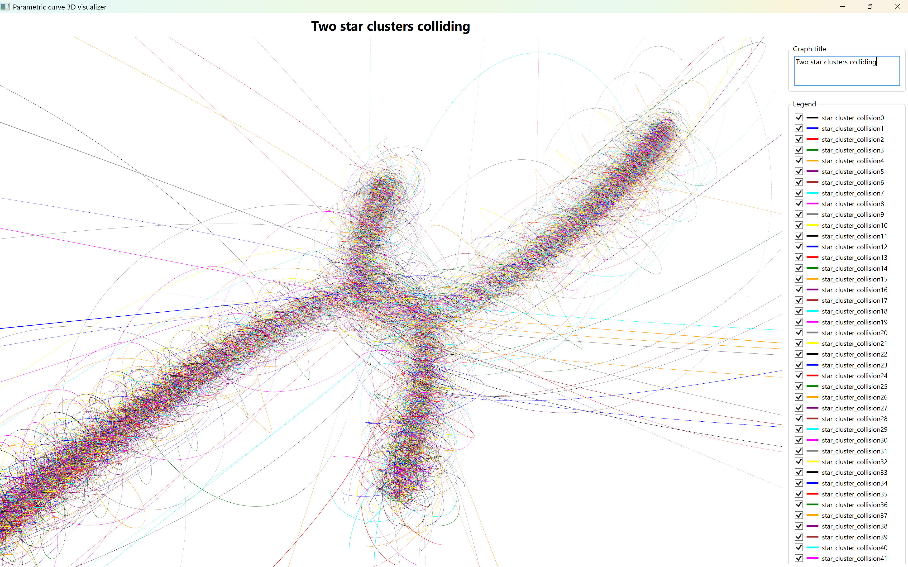
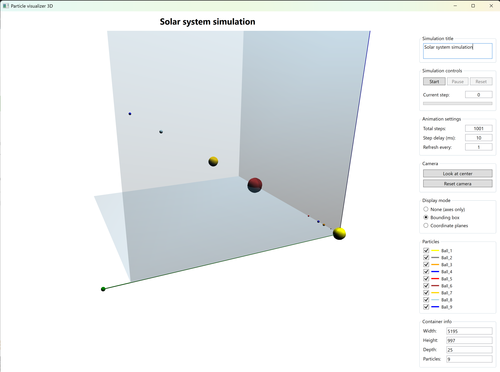

# MML - Minimal Math Library

**A comprehensive, single-header C++ mathematical library for numerical computing**

Minimal Math Library is my attempt at creating a simple, but comprehensive and widely usable math library for C++, where with just one #include "MML.h" directive you can get most of the basic math objects and operations you might need.

Using C++17 and working on all platforms (Windows, Linux, Mac), it also comes with extensive set of cross-platform visualization utilities.

---

Build status:

[](https://github.com/zvanjak/MML/actions?query=workflow%3AUbuntu)
[](https://github.com/zvanjak/MML/actions?query=workflow%3AWindows)
[](https://isocpp.org/std/the-standard)
[](tests/)
[](LICENSE.md)

---

## 📖 Table of Contents

- [Vision](#-vision)
- [Design Philosophy](#-design-philosophy)
- [Quick Start](#-quick-start)
- [Key Features](#-key-features)
- [Library Organization](#-library-organization)
  - [Base Types](#base-types)
  - [Core Components](#core-components)
  - [Algorithms](#algorithms)
  - [Tools & Utilities](#tools--utilities)
- [Real Examples](#-real-examples--physics-simulations)
- [Code Examples](#-code-examples)
- [Visualization](#-visualization)
- [Testing & Validation](#-testing--validation)
- [Demo Applications](#-demo-applications)
- [Documentation](#-documentation)
- [License](#-license)

---

## 🎯 Vision

**For C++ developers** on Windows, Mac, or Linux  
**Who need** simple yet powerful numerical computation capabilities  
**MML is a** modern, comprehensive, single-header mathematical library  
**That provides** vectors, matrices, tensors, functions, polynoms, coordinate systems, 2D and 3D geometry objects, ODE systems, with extensive set of numerical algorithms to work with them  
**Unlike** other C++ math libraries that require complex build systems and dependencies  
**MML** offers **trivial integration** - just include one header file and you're ready to compute

---

## 🏗️ Design Philosophy

MML is built on three core principles:

### 1. **Completeness & Simplicity**
It is a comprehensive numerical computing toolkit — from vectors and matrices to differential equations and field operations — with simple and intuitive syntax that makes mathematical objects first-class citizens in C++ without sacrificing performance.

```cpp
// Verify Gauss's Divergence Theorem: ∫∫∫(∇·F)dV = ∮∮(F·n̂)dS
// Define (non-separable) vector field F(x,y,z) = (sin(xy), cos(yz), exp(xz))
VectorFunction<3> F([](const VectorN<Real, 3>& p) {
    return VectorN<Real, 3>{ sin(p[0]*p[1]), cos(p[1]*p[2]), exp(p[0]*p[2]) };
});

// Compute divergence NUMERICALLY - no analytical formula needed!
ScalarFunctionFromStdFunc<3> divF([&F](const VectorN<Real, 3>& p) {
    return VectorFieldOperations::DivCart<3>(F, p);  // MML computes ∇·F for you
});

// Integration limits for unit cube [0,1]³
auto y_lo = [](Real) { return 0.0; };  auto y_hi = [](Real) { return 1.0; };
auto z_lo = [](Real,Real) { return 0.0; };  auto z_hi = [](Real,Real) { return 1.0; };

// Volume integral with different methods
Real volGauss = Integrate3D(divF, GAUSS10, 0, 1, y_lo, y_hi, z_lo, z_hi);  // 1.01945050739879
Real volTrap  = Integrate3D(divF, TRAP,    0, 1, y_lo, y_hi, z_lo, z_hi);  // 1.01946656155684

// Surface integral (flux) through all 6 faces of the cube
Cube3D unitCube(1.0, Point3Cartesian(0.5, 0.5, 0.5));
Real flux = SurfaceIntegration::SurfaceIntegral(F, unitCube, 1e-8);        // 1.01944989298179

std::cout << "GAUSS10 vs Surface: " << std::abs(volGauss - flux) << "\n";  // 6.14e-07  ✓
std::cout << "TRAP vs Surface:    " << std::abs(volTrap - flux) << "\n";   // 1.67e-05
```

### 2. **Correctness & Precision**
Rigorous numerical validation with **2,193 unit tests** across 93 test files, including dedicated testbeds that verify algorithms against known analytical solutions. Numerical methods are stress-tested with edge cases, ill-conditioned inputs, and long-time stability checks.

| Test Category | Tests | Validation Approach |
|---------------|-------|---------------------|
| Linear Algebra | 450+ | Known solutions, eigenvalues, SVD, condition numbers up to 10¹⁵ |
| Integration | 180+ | Analytical solutions, improper integrals, oscillatory & singular integrands |
| Derivation | 200+ | Analytical derivatives, multi-variable functions, tensor field Jacobians |
| ODE Solvers | 150+ | Energy conservation, stiff systems (λ = -10⁶), long-time stability |
| Root Finding | 120+ | Known roots, multiplicities, convergence rates |
| Interpolation | 100+ | Runge phenomenon, boundary effects, high-degree polynomials |

� **Precision Testing Application:** A dedicated command-line tool (`MML_TestingPrecisionApp`) runs comprehensive precision analysis across all numerical algorithms, comparing achieved vs theoretical precision and generating detailed reports.

📚 **Precision Analysis Reports:** [Overview](docs/testing_precision/README.md) · [Derivation](docs/testing_precision/DERIVATION_ANALYSIS.md) · [Integration](docs/testing_precision/INTEGRATION_ANALYSIS.md) · [Interpolation](docs/testing_precision/INTERPOLATION_ANALYSIS.md) · [ODE Solvers](docs/testing_precision/ODE_SOLVER_ANALYSIS.md) · [Root Finding](docs/testing_precision/ROOT_FINDING_ANALYSIS.md) · [Linear Algebra](docs/testing_precision/LINEAR_ALGEBRA_ANALYSIS.md)

### 3. **Trivial Integration**
The entire library in a single header file: **`MML.h`**
- No build system configuration
- No external dependencies
- No linking hassles
- Standard C++17

But, you can still use it piece-wise, by including only selected headers from `mml/` directory.

---

## 🚀 Quick Start

### Installation

**Option 1: Single Header (Recommended)**
```bash
# Download MML.h from releases
wget https://github.com/zvanjak/MML/releases/latest/download/MML.h

# Include in your project
#include "MML.h"
```

**Option 2: Build from Source**
```bash
git clone https://github.com/zvanjak/MML.git
cd MML
cmake -B build
cmake --build build
```

**Option 3: Visual Studio Code**

1. Open VS Code and press `Ctrl+Shift+P` (or `Cmd+Shift+P` on Mac)
2. Type **"Git: Clone"** and press Enter
3. Paste the repository URL:
   ```
   https://github.com/zvanjak/MML.git
   ```
4. Select a folder and open the cloned repository
5. When prompted, install recommended extensions (C/C++, CMake Tools)
6. Press `Ctrl+Shift+P` → **"CMake: Configure"** to set up the build
7. Press `F7` to build or use the CMake status bar

> 💡 **Tip:** The [CMake Tools extension](https://marketplace.visualstudio.com/items?itemName=ms-vscode.cmake-tools) provides IntelliSense, build buttons, and test integration out of the box.

### First Program

```cpp
#include "MML.h"
using namespace MML;

int main() {
    // Create a 4x4 general (non-symmetric) matrix with complex eigenvalues
    Matrix<Real> A{4, 4, { 0, -1,  0,  0,
                           1,  0,  0,  0,
                           0,  0,  0, -2,
                           0,  0,  2,  0}};
    Vector<Real> b{1, 2, 3, 4};
    
    // Solve linear system Ax = b using LU decomposition
    LUSolver<Real> solver(A);
    Vector<Real> x = solver.Solve(b);
    
    std::cout << "=== Linear System Solution ===" << std::endl;
    std::cout << "Matrix A:\n" << A << std::endl;
    std::cout << "RHS b: " << b << std::endl;
    std::cout << "Solution x: " << x << std::endl;
    
    // Verify: compute residual ||Ax - b||
    Vector<Real> residual = A * x - b;
    std::cout << "Residual ||Ax - b||: " << residual.NormL2() << std::endl;
    
    // Compute eigenvalues (general matrix - may have complex eigenvalues!)
    auto eigen = EigenSolver::Solve(A);
    
    std::cout << "\n=== Eigenvalue Decomposition ===" << std::endl;
    std::cout << "Eigenvalues (complex):" << std::endl;
    for (size_t i = 0; i < eigen.eigenvalues.size(); ++i) {
        auto& ev = eigen.eigenvalues[i];
        std::cout << "  λ[" << i << "] = " << ev.real;
        if (ev.isComplex()) 
            std::cout << " + " << ev.imag << "i";
        std::cout << std::endl;
    }
    std::cout << "Converged: " << (eigen.converged ? "YES" : "NO") 
              << " in " << eigen.iterations << " iterations" << std::endl;
    
    return 0;
}
```

**Compile:**
```bash
g++ -std=c++17 -O3 myprogram.cpp -o myprogram
./myprogram
```

---

## ✨ Key Features

### Mathematical Objects
- ✅ **Vectors** - Generic, fixed-size, 2D/3D Cartesian, Polar, Spherical, Cylindrical
- ✅ **Matrices** - Generic, symmetric, tridiagonal, band-diagonal
- ✅ **Tensors** - Rank 2-5 tensors in N dimensions
- ✅ **Quaternions** - Rotation representation, SLERP interpolation, Euler angles
- ✅ **Polynomials** - Generic over Real, Complex, Matrix fields
- ✅ **Functions** - Real, Scalar, Vector, Parametric curves/surfaces, Tensor fields
- ✅ **Geometry** - 2D/3D points, lines, planes, triangles, geometric bodies

### Numerical Methods
- ✅ **Linear Solvers** - Gauss-Jordan, LU, QR, SVD, Cholesky decomposition
- ✅ **Eigensolvers** - Symmetric and general real matrices
- ✅ **Derivation** - Orders 1, 2, 4, 6, 8 for all function types
- ✅ **Integration** - 1D, 2D, 3D; Trapezoidal, Simpson, Romberg, Monte Carlo
- ✅ **Path Integration** - Curve length, line integrals, work integrals
- ✅ **Surface Integration** - Flux integrals, surface area, parametric surfaces
- ✅ **Interpolation** - Linear, polynomial, rational, spline
- ✅ **ODE Solvers** - Euler, RK4, adaptive methods, BVP shooting
- ✅ **Root Finding** - Bracketing, Newton-Raphson, secant methods
- ✅ **Statistics** - Descriptive stats, distributions, hypothesis tests, ANOVA, confidence intervals

### Advanced Features
- ✅ **Fourier Analysis** - FFT, DFT, spectrum, windowing, convolution
- ✅ **Curve Fitting** - Linear, polynomial, exponential least squares
- ✅ **Optimization** - Gradient descent, Newton, conjugate gradient, simulated annealing
- ✅ **Field Operations** - grad, div, curl, Laplacian in multiple coordinate systems
- ✅ **Differential Geometry** - Curvature, torsion, Frenet frames
- ✅ **Coordinate Transforms** - Cartesian ↔ Cylindrical ↔ Spherical
- ✅ **Metric Tensors** - General, Cartesian, Cylindrical, Spherical coordinates
- ✅ **Function Analysis** - Find roots, extrema, inflection points

### Tools & Utilities
- ✅ **ConsolePrinter** - Beautiful table formatting with multiple export formats
- ✅ **Serializer** - Save mathematical objects to files
- ✅ **Visualizers** - External tools for plotting functions, fields, curves, surfaces
- ✅ **Test Beds** - 8 comprehensive test suites with 250+ validated test cases

---

## 📚 Library Organization

MML is organized into four main layers:

### Top-Level Navigation
- **Base layer**: Start with foundational types — see [base/README_Base.md](docs/base/README_Base.md). Highlights: [base/Vectors.md](docs/base/Vectors.md), [base/VectorN.md](docs/base/VectorN.md), [base/Matrices.md](docs/base/Matrices.md), [base/Matrix.md](docs/base/Matrix.md), [base/MatrixNM.md](docs/base/MatrixNM.md), [base/Tensors.md](docs/base/Tensors.md), [base/Geometry.md](docs/base/Geometry.md).
- **Core layer**: Operations and calculus — see [core/README_Core.md](docs/core/README_Core.md). Highlights: [core/Derivation.md](docs/core/Derivation.md), [core/Linear_equations_solvers.md](docs/core/Linear_equations_solvers.md), [core/Field_operations.md](docs/core/Field_operations.md), [core/Coordinate_transformations.md](docs/core/Coordinate_transformations.md), [core/Metric_tensor.md](docs/core/Metric_tensor.md).
- **Algorithms layer**: Problem-solving methods — see [algorithms/README_Algorithms.md](docs/algorithms/README_Algorithms.md). Highlights: [algorithms/Root_finding.md](docs/algorithms/Root_finding.md), [algorithms/Differential_equations_solvers.md](docs/algorithms/Differential_equations_solvers.md), [algorithms/Eigen_solvers.md](docs/algorithms/Eigen_solvers.md), [algorithms/MonteCarlo_integration.md](docs/algorithms/MonteCarlo_integration.md).
- **Tools layer**: Practical utilities for output, serialization, and visualization. Highlights: [tools/ConsolePrinter.md](docs/tools/ConsolePrinter.md), [tools/Serializer.md](docs/tools/Serializer.md), [tools/Visualizers.md](docs/tools/Visualizers.md).

### Base Types

**Foundation classes** - the building blocks used throughout the library.

| Component | Description | Documentation |
|-----------|-------------|---------------|
| **Vectors** | Generic `Vector<T>`, fixed-size `VectorN<T,N>`, specialized 2D/3D types | [Vectors.md](docs/base/Vectors.md) |
| **Matrices** | Generic `Matrix<T>`, `MatrixNM<N,M>`, Symmetric, Tridiagonal, Band-diagonal | [Matrices.md](docs/base/Matrices.md) |
| **Tensors** | Rank 2-5 tensors: `Tensor2<Dim>`, `Tensor3<Dim>`, etc. | [Tensors.md](docs/base/Tensors.md) |
| **Polynomials** | Generic `Polynom<T>` over Real, Complex, Matrix fields | [Polynoms.md](docs/base/Polynoms.md) |
| **Functions** | `IRealFunction`, `IScalarFunction<N>`, `IVectorFunction<N>` | [Functions.md](docs/base/Functions.md) |
| **Interpolation** | Linear, polynomial, rational, barycentric, spline, 2D | [Interpolated_functions.md](docs/base/Interpolated_functions.md) |
| **Geometry** | Points, lines, segments, planes, triangles, geometric bodies | [Geometry.md](docs/base/Geometry.md), [Geometry_2D_3D.md](docs/base/Geometry_2D_3D.md) |
| **Quaternions** | Rotation representation, SLERP interpolation, Euler angles | [Quaternions.md](docs/base/Quaternions.md) |
| **Standard Functions** | Predefined mathematical functions | [Standard_functions.md](docs/base/Standard_functions.md) |
| **Utilities** | Matrix helpers (IsOrthogonal, IsUnitary, IsHermitian) | [BaseUtils.md](docs/base/BaseUtils.md) |

**Key Vector Types:**
```cpp
Vector<Real>              // Dynamic size
VectorN<Real, 3>          // Fixed size
Vector2Cartesian          // 2D Cartesian (x, y)
Vector2Polar              // 2D Polar (r, θ)
Vector3Cartesian          // 3D Cartesian (x, y, z)
Vector3Spherical          // 3D Spherical (r, θ, φ)
Vector3Cylindrical        // 3D Cylindrical (ρ, φ, z)
```

**Key Matrix Types:**
```cpp
Matrix<Real>              // Generic mxn matrix
MatrixNM<N, M>            // Fixed-size NxM matrix
MatrixSym                 // Symmetric matrix
MatrixTridiag             // Tridiagonal matrix
MatrixBandDiag            // Band-diagonal matrix
```

**Tensor Types:**
```cpp
Tensor2<3>                // Rank-2 tensor in 3D (3x3 matrix-like)
Tensor3<3>                // Rank-3 tensor in 3D (3x3x3)
Tensor4<3>                // Rank-4 tensor in 3D
```

**Function Interfaces:**
```cpp
IRealFunction             // f: ℝ → ℝ
IScalarFunction<N>        // f: ℝⁿ → ℝ
IVectorFunction<N>        // f: ℝⁿ → ℝⁿ
IParametricCurve<N>       // r: ℝ → ℝⁿ
IParametricSurface<N>     // r: ℝ² → ℝⁿ
ITensorField<N>           // T: ℝⁿ → Tensor
```

---

### Core Components

**Mathematical objects and operations** - the heart of MML.

| Component | Description | Documentation |
|-----------|-------------|---------------|
| **Curves & Surfaces** | Parametric curves, surfaces, predefined examples | [Curves_and_surfaces.md](docs/core/Curves_and_surfaces.md) |
| **Linear Solvers** | GJ, LU, QR, SVD, Cholesky decomposition | [Linear_equations_solvers.md](docs/core/Linear_equations_solvers.md) |
| **Derivation** | Numerical derivatives (orders 1, 2, 4, 6, 8) | [Derivation.md](docs/core/Derivation.md) |
| **Integration** | 1D, 2D, 3D integration algorithms | [Integration.md](docs/core/Integration.md), [Multidim_integration.md](docs/core/Multidim_integration.md) |
| **Path Integration** | Curve length, line integrals, work integrals | [Path_integration.md](docs/algorithms/Path_integration.md) |
| **Surface Integration** | Flux integrals, surface area, parametric surfaces | [Integration.md](docs/core/Integration.md) |
| **Field Operations** | grad, div, curl, Laplacian | [Field_operations.md](docs/core/Field_operations.md) |
| **ODE Systems** | Differential equation systems | [ODE_system.md](docs/base/ODE_system.md) |
| **Coordinates** | Transformations between coordinate systems | [Coordinate_transformations.md](docs/core/Coordinate_transformations.md) |
| **Metric Tensors** | Coordinate system metrics | [Metric_tensor.md](docs/core/Metric_tensor.md) |
| **Dirac Delta** | Distributions for delta function | [Dirac_delta_function.md](docs/core/Dirac_delta_function.md) |
| **Fields** | Predefined example fields | [Fields.md](docs/core/Fields.md) |

---

### Algorithms

**Problem-solving algorithms** - advanced numerical methods.

| Algorithm | Description | Documentation |
|-----------|-------------|---------------|
| **Root Finding** | Bracketing, Newton-Raphson, secant methods | [Root_finding.md](docs/algorithms/Root_finding.md) |
| **Eigensolvers** | Symmetric and general real matrix eigenvalues | [Eigen_solvers.md](docs/algorithms/Eigen_solvers.md) |
| **ODE Solvers** | Euler, RK4, adaptive methods for ODE systems | [Differential_equations_solvers.md](docs/algorithms/Differential_equations_solvers.md) |
| **Optimization** | Gradient descent, Newton, CG, BFGS, simulated annealing | [Function_optimization.md](docs/algorithms/Function_optimization.md) |
| **Monte Carlo** | Monte Carlo integration with importance sampling | [MonteCarlo_integration.md](docs/algorithms/MonteCarlo_integration.md) |
| **Fourier Transform** | FFT, DFT, spectrum analysis, windowing, convolution | [Fourier_transformation.md](docs/algorithms/Fourier_transformation.md) |
| **Differential Geometry** | Curvature, torsion, Frenet frames | [Differential_geometry.md](docs/algorithms/Differential_geometry.md) |
| **Statistics** | Distributions, hypothesis tests, ANOVA, confidence intervals | [Statistics.md](docs/algorithms/Statistics.md) |
| **Function Analyzer** | Find roots, extrema, inflection points | [Function_analyzer.md](docs/algorithms/Function_analyzer.md) |

---

### Tools & Utilities

**Practical tools** for working with mathematical objects — the fourth layer of MML.

| Tool | Description | Documentation |
|------|-------------|---------------|
| **ConsolePrinter** | Beautiful table formatting, 6 export formats (TXT, CSV, JSON, HTML, LaTeX, Markdown), 5 border styles | [ConsolePrinter.md](docs/tools/ConsolePrinter.md) |
| **Serializer** | Save functions, ODE solutions, particle simulations, vector fields to files | [Serializer.md](docs/tools/Serializer.md) |
| **Visualizers** | Cross-platform plotting for functions, fields, curves, surfaces, particles | [Visualizers.md](docs/tools/Visualizers.md) |
| **Random** | Random number generators for simulations and Monte Carlo | Built-in utility |

**Why Tools Matter:**

The Tools layer bridges the gap between computation and presentation. Whether you're debugging numerical algorithms, preparing results for publication, or creating animations for teaching — these utilities make it effortless:

- **ConsolePrinter**: Format any vector, matrix, or table into publication-quality output with a single call
- **Serializer**: Persist simulation results for later analysis or visualization in external tools
- **Visualizers**: Launch real-time viewers directly from code — no manual data export needed

#### 🖼️ Visualization Preview

| Real Functions | 3D Surfaces | Parametric Curves | Vector Fields |
|:--------------:|:-----------:|:-----------------:|:-------------:|
|  |  |  |  |

See the full [Visualization Gallery](#-visualization-gallery) below for all visualizer types.

---

## 🧪 Real Examples — Physics Simulations You Can Run

> **Self-contained, production-ready examples** demonstrating MML's capabilities in real-world physics simulations. Each example includes all physics code in-directory — no external dependencies.

### 🌌 [Example 00: N-Body Gravity](docs/examples/Example_00_N_body_gravity.md) — *Flagship Example*

**Solar System & Star Cluster Simulations**

| Solar System Simulation | Star Cluster Collision |
|:-----------------------:|:----------------------:|
|  |  |
| *Inner planets orbital mechanics* | *Two star clusters gravitational interaction* |

| Particle Simulation View | Cluster Collision Dynamics |
|:------------------------:|:--------------------------:|
|  |  |
| *Real-time particle visualization* | *Multi-body gravitational chaos* |

- Newton's law of universal gravitation with configurable G
- **7 integrators** with different accuracy/performance tradeoffs:
  | Solver | Type | Best For |
  |--------|------|----------|
  | `SolveEuler()` | Fixed-step | Educational (terrible energy conservation) |
  | `SolveRK4()` | Fixed-step | Short simulations (energy drifts over time) |
  | `SolveVerlet()` | **Symplectic** | Long-term orbits (excellent energy conservation!) |
  | `SolveLeapfrog()` | **Symplectic** | Long-term orbits (equivalent to Verlet) |
  | `SolveRK5()` | Adaptive Cash-Karp | High accuracy with step control |
  | `SolveDP5()` | Adaptive Dormand-Prince 5 | High accuracy, FSAL optimization |
  | `SolveDP8()` | Adaptive Dormand-Prince 8 | **Highest accuracy** |
- Two pre-configured scenarios: Solar System and Star Cluster Collision
- Self-contained physics engine (~870 lines) — no MML dependency for physics!

```cpp
// Simulate the Solar System for 10 years with different solvers
NBodyGravitySimConfig config = NBodyGravityConfigGenerator::Config1_Solar_system();
NBodyGravitySimulator solver(config);

// For long-term orbital stability, use symplectic integrators:
auto results_verlet = solver.SolveVerlet(0.01, 365000);      // 10 years, dt=0.01 days

// For highest accuracy on shorter runs:
auto results_dp8 = solver.SolveDP8(10.0, 1e-12, 0.01, 0.001); // 10 years, adaptive DP8
```

### Other Examples

| # | Example | Description | Key Features |
|---|---------|-------------|--------------|
| 01 | **[Projectile Launch](docs/examples/Example_01_projectile_launch.md)** | Ballistic trajectory with air resistance | Drag models, vacuum vs air comparison, ODE integration |
| 02 | **[Double Pendulum](docs/examples/Example_02_double_pendulum.md)** | Chaotic dynamics visualization | Sensitivity to initial conditions, phase space, Lyapunov behavior |
| 03 | **[2D Collision Simulator](docs/examples/Example_03_collision_simulator_2d.md)** | Large-scale elastic collisions | **30,000+ balls**, spatial subdivision, parallel execution, shock waves |
| 04 | **[Lorentz Transformations](docs/examples/Example_04_Lorentz_transformations.md)** | Special relativity & Twin Paradox | Time dilation, worldlines, coordinate transforms |

### 🚀 Try It Now

```bash
cmake -B build && cmake --build build

# Run the flagship N-Body simulation
./build/src/examples/Release/Example00_NBodyGravity      # Windows
./build/src/examples/Example00_NBodyGravity              # Linux
```

All examples produce visualization output viewable with the included Qt-based viewers.

> ⚠️ **Qt Visualizer Compatibility Note:** The prebuilt Qt visualizers for Linux require **Qt 6.9.0** runtime libraries. If you have a different Qt version installed, you may need to rebuild the visualizers from source (see Github repo `https://github.com/zvanjak/MML_Linux_Visualizers`). The WPF visualizers on Windows depend on NET 8 runtime libraries being installed on the system.

---

## 💡 Code Examples

### Vectors & Matrices

Basic vector and matrix operations with complex number support:

```cpp
#include "MML.h"
using namespace MML;

// Real vectors and matrices
Vector<double> vec1{1.5, -2.0, 0.5}, vec2{1.0, 1.0, -3.0};
Matrix<double> mat_3x3{3, 3, {1.0,  2.0, -1.0,
                             -1.0,  5.0,  6.0,
                              3.0, -2.0,  1.0}};
Matrix<double> unit_mat = Matrix<double>::GetUnitMatrix(3);

// Vector and matrix arithmetic
Vector<double> result = 2.0 * (vec1 + vec2) * mat_3x3 / vec1.NormL2();
std::cout << "Result: " << result << std::endl;

// Complex vectors and matrices
VectorComplex vec_cmplx{{Complex(1,1), Complex(-1,2)}};
MatrixComplex mat_cmplx{2, 2, {Complex(0.5,1),  Complex(-1,2),
                               Complex(-1,-2), Complex(-2,2)}};

VectorComplex complex_result = vec_cmplx * mat_cmplx / Complex(1.5, -1.5);

// Matrix properties
std::cout << "IsOrthogonal(mat_3x3)  = " << Utils::IsOrthogonal(mat_3x3) << std::endl;
std::cout << "IsHermitian(mat_cmplx) = " << Utils::IsHermitian(mat_cmplx) << std::endl;
std::cout << "IsUnitary(mat_cmplx)   = " << Utils::IsUnitary(mat_cmplx) << std::endl;
```

---

### Linear Systems & Eigenvalues

Solve linear systems and compute eigenvalues:

```cpp
// Define a linear system Ax = b
Matrix<Real> A{5, 5, {0.2,  4.1, -2.1, -7.4,  1.6,
                      1.6,  1.5, -1.1,  0.7,  5.0,
                     -3.8, -8.0,  9.6, -5.4, -7.8,
                      4.6, -8.2,  8.4,  0.4,  8.0,
                     -2.6,  2.9,  0.1, -9.6, -2.7}};
Vector<Real> b{1.1, 4.7, 0.1, 9.3, 0.4};

// Solve using LU decomposition
LUDecompositionSolver<Real> luSolver(A);
Vector<Real> x = luSolver.Solve(b);

std::cout << "Solution: " << x << std::endl;
std::cout << "Verification: " << (A * x) << std::endl;

// Compute eigenvalues
Matrix<Real> mat_copy(A);
EigenSolver eigenSolver(mat_copy, true, false);

std::cout << "\nNum real eigenvalues: " << eigenSolver.getNumReal() << std::endl;
std::cout << "Eigenvalues: " << eigenSolver.getEigenvalues() << std::endl;
```

**Output:**
```
Solution: [-5.56850, -5.94469, -5.00762, -1.39364, 3.59876]
Eigenvalues: [(12.974,0), (0.99944,0), (-0.033184,0), (-2.4701,12.994), (-2.4701,-12.994)]
```

---

### Functions & Interpolation

MML provides multiple ways to define and use functions: real-valued (`IRealFunction`), scalar fields (`IScalarFunction<N>`), vector fields (`IVectorFunction<N>`), parametric curves/surfaces, and interpolated functions with linear/polynomial/spline strategies. Visualizers can plot 1D/2D/3D functions and fields.

Create and work with mathematical functions:

```cpp
// Method 1: Lambda function
RealFunction f1{[](double x) { return sin(x) * (1.0 + 0.5*x*x); }};

// Method 2: Different function types
ScalarFunction<3> scalar_func([](const VectorN<Real, 3> &x) { 
    return x[0]*x[0] + x[1]*x[1] + x[2]*x[2]; 
});

VectorFunction<3> vector_func([](const VectorN<Real, 3> &x) -> VectorN<Real, 3> { 
    return {x[1]*x[2], x[0]*x[2], x[0]*x[1]}; 
});

ParametricCurve<3> helix([](double t) -> VectorN<Real, 3> { 
    return {cos(t), sin(t), 0.2*t}; 
});

// Interpolation from data
Vector<Real> x_data{0, 2.5, 5.0, 7.5, 10.0};
Vector<Real> y_data{0, 1.5, 4.0, 9.5, 16.0};

LinearInterpRealFunc   linear_interp(x_data, y_data);
PolynomInterpRealFunc  poly_interp(x_data, y_data, 3);
SplineInterpRealFunc   spline_interp(x_data, y_data);

Real x = 3.7;
std::cout << "Linear: " << linear_interp(x) << std::endl;
std::cout << "Spline: " << spline_interp(x) << std::endl;
```

---

### Numerical Calculus

MML provides high-order numerical derivatives and integration with error estimates.

**Numerical Derivatives with Precision Analysis:**

```cpp
// Compare derivative orders on f(x) = sin(x) at x = 1.0
// Analytical derivative: f'(1) = cos(1) ≈ 0.5403023058681398

RealFunction f{[](Real x) { return std::sin(x); }};
Real x = 1.0;
Real analytical = std::cos(1.0);

Real der1 = Derivation::NDer1(f, x);   // O(h²) - 2-point
Real der2 = Derivation::NDer2(f, x);   // O(h⁴) - 4-point  
Real der4 = Derivation::NDer4(f, x);   // O(h⁶) - 6-point
Real der6 = Derivation::NDer6(f, x);   // O(h⁸) - 8-point
Real der8 = Derivation::NDer8(f, x);   // O(h¹⁰) - 10-point

std::cout << std::scientific << std::setprecision(10);
std::cout << "Order 1 error: " << std::abs(der1 - analytical) << std::endl;  // ~1e-11
std::cout << "Order 6 error: " << std::abs(der6 - analytical) << std::endl;  // ~1e-14
std::cout << "Order 8 error: " << std::abs(der8 - analytical) << std::endl;  // ~1e-15
```

**Numerical Integration with Convergence:**

```cpp
// Integrate f(x) = sin(x) from 0 to π
// Analytical result: ∫sin(x)dx = 2.0

RealFunction f{[](Real x) { return std::sin(x); }};
Real a = 0.0, b = M_PI;
Real analytical = 2.0;

Real trap  = Integration::Trapezoid(f, a, b, 100);
Real simp  = Integration::Simpson(f, a, b, 100);
Real romb  = Integration::Romberg(f, a, b, 1e-10);

std::cout << "Trapezoid error: " << std::abs(trap - analytical) << std::endl;  // ~2e-4
std::cout << "Simpson error:   " << std::abs(simp - analytical) << std::endl;  // ~2e-9
std::cout << "Romberg error:   " << std::abs(romb - analytical) << std::endl;  // ~1e-14

// Multi-dimensional integration
ScalarFunction<3> volume_func([](const VectorN<Real, 3>& x) {
    return x[0]*x[0] + x[1]*x[1] + x[2]*x[2];  // x² + y² + z²
});

// Monte Carlo for high-dimensional integrals
auto mc_result = MonteCarloIntegration::IntegrateBox(
    volume_func, 
    {0, 0, 0},      // Lower bounds
    {1, 1, 1},      // Upper bounds
    100000          // Samples
);
std::cout << "MC estimate: " << mc_result.value 
          << " ± " << mc_result.error_estimate << std::endl;
```

**Field Operations:**

```cpp
// Scalar field: gravitational potential φ(x,y,z) = -1/r
ScalarFunction<3> potential([](const VectorN<Real, 3>& x) {
    return -1.0 / x.NormL2();
});
VectorN<Real, 3> pos{1.0, 2.0, 2.0};

// Gradient ∇φ (gives force direction)
auto grad = ScalarFieldOperations::GradientCart<3>(potential, pos);

// Laplacian ∇²φ (zero outside mass for gravity!)
Real laplacian = ScalarFieldOperations::LaplacianCart<3>(potential, pos);

// Vector field: velocity field v(x,y,z)
VectorFunction<3> velocity([](const VectorN<Real, 3>& x) -> VectorN<Real, 3> {
    return {x[1], -x[0], x[2]};  // Rotating flow
});

// Divergence ∇·v (compression/expansion rate)
Real div = VectorFieldOperations::DivergenceCart(velocity, pos);

// Curl ∇×v (rotation/vorticity)
auto curl = VectorFieldOperations::CurlCart(velocity, pos);
```

---

### Differential Equations

Solve ODE systems:

```cpp
// Define ODE system: dx/dt = f(t, x)
// Example: Simple harmonic oscillator
auto oscillator = [](Real t, const Vector<Real> &y) -> Vector<Real> {
    // y[0] = position, y[1] = velocity
    Real omega = 2.0;
    return Vector<Real>{y[1], -omega*omega*y[0]};
};

ODESystem system(oscillator, 2);
Vector<Real> initial_cond{1.0, 0.0};  // x(0) = 1, v(0) = 0

// Solve with RK4
ODESolver solver(/*params*/);
ODESystemSolution solution = solver.solve(system, initial_cond, 0.0, 10.0, 0.01);

// Visualize
Visualizer::VisualizeODESysSolAsMultiFunc(
    solution, "Harmonic Oscillator", 
    {"Position", "Velocity"}, "oscillator.txt");
```

---

## 📊 Visualization

MML includes a powerful **cross-platform visualization suite** for functions, fields, curves, surfaces, and particle systems. All visualizers work on both Windows (WPF) and Linux (Qt).

### 🖼️ Visualization Gallery

<table>
<tr>
<td align="center" width="33%">

**Real Functions**


*sin(x) × (x-3)(x+5) / √|2-x|*

</td>
<td align="center" width="33%">

**Multi-Function Comparison**


*Compare f(x) and f'(x)*

</td>
<td align="center" width="33%">

**3D Scalar Surfaces**


*f(x,y) = 3x(x²-3y²)/25*

</td>
</tr>
<tr>
<td align="center">

**2D Parametric Curves**


*Lissajous figures*

</td>
<td align="center">

**3D Parametric Curves**


*Helix & toroidal spirals*

</td>
<td align="center">

**2D Vector Fields**


*Two-body gravity field*

</td>
</tr>
<tr>
<td align="center">

**2D Particle Systems**


*Animated with playback*

</td>
<td align="center">

**3D Particle Systems**


*N-body trajectories*

</td>
<td align="center">

**Linux Support**


*Qt-based cross-platform*

</td>
</tr>
</table>

### Available Visualizers

All visualizers have **complete cross-platform support** with multiple backend options:
- **Windows**: WPF-based visualizers (primary)
- **Linux**: Qt-based visualizers (primary), FLTK for lightweight 2D

| Visualizer | Purpose | Output | Platform |
|------------|---------|--------|----------|
| **RealFunctionVisualizer** | Plot 1D functions | 2D graphs | Windows (WPF), Linux (Qt/FLTK) |
| **MultiRealFunctionVisualizer** | Compare multiple 1D functions | 2D overlaid graphs | Windows (WPF), Linux (Qt/FLTK) |
| **ScalarFunction2DVisualizer** | 3D surface plots | 3D surfaces | Windows (WPF), Linux (Qt) |
| **ParametricCurve2DVisualizer** | 2D parametric curves | 2D curves | Windows (WPF), Linux (Qt/FLTK) |
| **ParametricCurve3DVisualizer** | 3D parametric curves | 3D curves | Windows (WPF), Linux (Qt) |
| **VectorField2DVisualizer** | 2D vector field arrows | 2D arrow plots | Windows (WPF), Linux (Qt/FLTK) |
| **VectorField3DVisualizer** | 3D vector field arrows | 3D arrow plots | Windows (WPF), Linux (Qt) |
| **ParticleVisualizer2D** | Animated 2D particle systems | 2D animations with playback | Windows (WPF), Linux (Qt) |
| **ParticleVisualizer3D** | Animated 3D particle systems | 3D animations with playback | Windows (WPF), Linux (Qt) |
| **ODESolutionVisualizer** | ODE solution trajectories | Multi-function plots | Windows (WPF), Linux (Qt/FLTK) |

**Visualization Examples** (`src/visualization_examples/`):
- Comprehensive demos for every visualizer type
- Ready-to-run code showing all visualization capabilities
- Examples of custom styling, multi-plot layouts, and animation controls

### Visualization Examples

**Real Function Plotting:**

```cpp
RealFunction f{[](Real x) { return sin(x) * (x-3)*(x+5) / sqrt(std::abs(2 - x)); }};
Visualizer::VisualizeRealFunction(f, "Complex Function", 
                                  -10.0, 10.0, 500, "function.txt");

// Compare original and derivative
RealFuncDerived4 df(f);
Visualizer::VisualizeMultiRealFunction(
    {&f, &df}, "Function and Derivative",
    {"f(x)", "f'(x)"}, -10.0, 10.0, 500, "comparison.txt");
```

| Windows | Linux |
|:-------:|:-----:|
|  |  |

**3D Surface Plotting:**

```cpp
ScalarFunction<2> surface{[](const VectorN<Real, 2> &x) { 
    return 3*x[0]/5 * (x[0]*x[0]/25 - 3*x[1]*x[1]/25); 
}};

Visualizer::VisualizeScalarFunc2DCartesian(
    surface, "3D Surface", 
    -10, 10, 50, -10, 10, 50, "surface.txt");
```

| Windows (Two Gaussian Bumps) | Linux (Qt - Beautiful Rendering) |
|:----------------------------:|:--------------------------------:|
|  |  |

| More Windows Surfaces |
|:---------------------:|
|  |
|  |

**Parametric Curves:**

```cpp
// Helix curve
Curves3D::HelixCurve helix(20.0, 2.0);
Visualizer::VisualizeParamCurve3D(
    helix, "Helix", -50.0, 50.0, 1000, "helix.txt");

// Toroidal spiral
Curves3D::ToroidalSpiralCurve toroid(20.0);
Visualizer::VisualizeParamCurve3D(
    toroid, "Toroidal Spiral", 
    0, 2*M_PI, 5000, "toroid.txt");
```

| 2D Curves | 3D Curves |
|:---------:|:---------:|
|  |  |
|  |  |

**Vector Fields:**

```cpp
// Gravity field of two masses
VectorFunction<3> gravity{[](const VectorN<Real, 3> &x) {
    const VectorN<Real, 3> x1{100, 0, 0}, x2{-100, 0, 0};
    const Real m1 = 1000, m2 = 1000, G = 10;
    
    return -G * m1 * (x - x1) / pow((x - x1).NormL2(), 3)
           -G * m2 * (x - x2) / pow((x - x2).NormL2(), 3);
}};

Visualizer::VisualizeVectorField3DCartesian(
    gravity, "Gravity Field",
    -200, 200, 15, -200, 200, 15, -200, 200, 15, "gravity.txt");
```

| Windows | Linux |
|:-------:|:-----:|
|  |  |

### Data Export

All visualizers use serialized data files that can also be loaded by external tools (Python, MATLAB, etc.):

```cpp
// Serialize function data
Serializer::SaveRealFunc(f, "Function", 0, 10, 100, "data.txt");

// Serialize ODE solution
Serializer::SaveODESolutionAsMultiFunc(
    solution, "ODE Solution", {"x", "v"}, "ode_data.txt");

// Serialize 2D vector field
Serializer::SaveVectorFunc2DCartesian(
    field, "Vector Field", -10, 10, 20, -10, 10, 20, "field_data.txt");
```

---

## 🧪 Testing & Validation

MML emphasizes correctness and numerical precision.

### Test Organization

Tests are organized by library layer for easy navigation:

```
tests/
├── base/                      # Base types tests
│   ├── vector_tests.cpp           # Vector operations
│   ├── vectorn_tests.cpp          # VectorN<T,N> operations
│   ├── matrix_tests.cpp           # Matrix operations
│   ├── tensors_tests.cpp          # Tensor operations
│   ├── polynom_tests.cpp          # Polynomial operations
│   ├── geometry_2d_tests.cpp      # 2D geometry
│   ├── geometry_3d_tests.cpp      # 3D geometry
│   ├── interpolated_functions_tests.cpp
│   └── ...
├── core/                      # Core functionality tests
│   ├── derivation_tests.cpp       # Numerical derivatives
│   ├── integration_tests.cpp      # Numerical integration
│   ├── linear_alg_eq_solvers_tests.cpp
│   ├── field_operations_tests.cpp
│   ├── metric_tensor_tests.cpp
│   ├── coord_transf_tests.cpp
│   └── ...
├── algorithms/                # Algorithm tests
│   ├── root_finding_tests.cpp
│   ├── eigensystem_solvers_tests.cpp
│   ├── ode_system_solvers_tests.cpp
│   ├── bvp_shooting_method_tests.cpp
│   ├── fourier_fft_tests.cpp
│   ├── fourier_spectrum_tests.cpp
│   ├── monte_carlo_integration_tests.cpp
│   ├── curve_fitting_tests.cpp
│   ├── optimization_tests.cpp
│   ├── statistics_tests.cpp
│   └── ...
└── precision/                 # Numerical precision tests
    └── ...
```

### Running Tests

```bash
# Build and run all tests
cmake -B build
cmake --build build
cd build && ctest

# Run specific test
ctest -R test_derivation -V

# Run with detailed output
ctest --output-on-failure
```

### Test Beds

Predefined test cases with known analytical solutions for validation and experimentation:

| Test Bed | Description | Documentation |
|----------|-------------|---------------|
| **Functions** | 50+ real, scalar, vector test functions with derivatives | [Functions_testbed.md](docs/testbeds/Functions_testbed.md) |
| **Curves & Surfaces** | 40+ parametric curves and surfaces with curvature | [ParametricCurvesSurfaces_testbed.md](docs/testbeds/ParametricCurvesSurfaces_testbed.md) |
| **Linear Systems** | 37 systems incl. Hilbert, Vandermonde, ill-conditioned | [LinAlgSystems_testbed.md](docs/testbeds/LinAlgSystems_testbed.md) |
| **ODE Systems** | 30+ ODEs: Lorenz, pendulum, stiff systems | [ODESystems_testbed.md](docs/testbeds/ODESystems_testbed.md) |
| **Integration** | 40+ integrands: oscillatory, singular, improper | [Integration_testbed.md](docs/testbeds/Integration_testbed.md) |
| **Optimization** | 25+ functions: Rosenbrock, Rastrigin, constrained | [Optimization_testbed.md](docs/testbeds/Optimization_testbed.md) |
| **Root Finding** | 30+ equations: polynomials, transcendental, multiple roots | [RootFinding_testbed.md](docs/testbeds/RootFinding_testbed.md) |
| **Eigensolvers** | 27 matrices: defective, clustered, ill-conditioned | [Eigensolvers_testbed.md](docs/testbeds/Eigensolvers_testbed.md) |

**Using Test Beds:**

```cpp
// Get predefined test function
auto test_func = TestBeds::RealFunctionsTestBed::getTestFunctionReal("Sin");
RealFunction f = test_func._func;

// Get predefined curve
auto test_curve = TestBeds::ParametricCurvesTestBed::getTestCurve("Helix");
ParametricCurve<3> curve = test_curve._curve;

// Get predefined linear system
auto test_system = TestBeds::LinAlgSystemsTestBed::getTestSystem("Hilbert5");
Matrix<Real> A = test_system._matrix;
Vector<Real> b = test_system._rhs;
```

### Precision Testing

Detailed precision analysis for numerical methods:

- [Derivation Precision](docs/testing_precision/TestDerivationPrecision.md) - Error analysis for numerical derivatives
- [Integration Precision](docs/testing_precision/TestIntegrationPrecision.md) - Convergence studies for integration
- [Interpolation Precision](docs/testing_precision/TestInterpolationPrecision.md) - Interpolation error analysis
- [Vector Field Operations](docs/testing_precision/TestVectorFieldOperationsPrecision.md) - Field operation accuracy

**Example - Function Analysis:**

```cpp
// Analyze function properties
RealFunction f{[](Real x) { return 1 / (x - 1); }};
RealFunctionAnalyzer analyzer(f, "1 / (x - 1)");
analyzer.PrintIntervalAnalysis(-5.0, 5.0, 50, 1e-4);

/* OUTPUT:
f(x) = 1 / (x - 1) - Function analysis in interval [-5.00, 5.00]:
  Defined    : no  (Not defined at: 1.0)
  Continuous : yes
  Monotonic  : no
  Min        : -5.0
  Max        : inf
*/
```

---

## 🎮 Demo Applications

MML includes comprehensive demos showcasing library capabilities.

### Directory Structure

```
src/
├── demo_app/                # General library demos
├── readme_examples/         # Examples from this README
├── examples/                # Practical end-to-end examples
├── visualization_examples/  # Visualizer demonstrations
├── testing_precision/       # Precision analysis demos
├── testing_speed/           # Performance benchmarks
├── book/                    # Physics book examples (MPL)
└── docs_demos/              # Documentation code samples
```

### Building Demos

```bash
# Build all demos
cmake -B build
cmake --build build

# Run specific demo
./build/src/book/example8_gravity

# On Windows
.\build\src\book\Release\example8_gravity.exe
```

---

## 📖 Documentation

Comprehensive documentation organized by topic:

### Core Documentation

- **Base Types**: [Vectors](docs/base/Vectors.md) | [Matrices](docs/base/Matrices.md) | [Tensors](docs/base/Tensors.md) | [Polynomials](docs/base/Polynoms.md) | [Quaternions](docs/base/Quaternions.md)
- **Functions**: [Functions](docs/base/Functions.md) | [Interpolation](docs/base/Interpolated_functions.md) | [Curves & Surfaces](docs/core/Curves_and_surfaces.md)
- **Numerical Methods**: [Derivation](docs/core/Derivation.md) | [Integration](docs/core/Integration.md) | [Linear Solvers](docs/core/Linear_equations_solvers.md)
- **Algorithms**: [Root Finding](docs/algorithms/Root_finding.md) | [ODE Solvers](docs/algorithms/Differential_equations_solvers.md) | [Eigensolvers](docs/algorithms/Eigen_solvers.md)
- **Tools**: [ConsolePrinter](docs/tools/ConsolePrinter.md) | [Serializer](docs/tools/Serializer.md) | [Visualizers](docs/tools/Visualizers.md)

### Additional Resources

- [Lines of Code Report](docs/LOC_REPORT.md) - Project statistics
- [Test Beds](docs/testbeds/) - Predefined test cases
- [Examples](docs/examples/) - Real-world use cases

---

### Development Setup

```bash
# Clone repository
git clone https://github.com/zvanjak/MML.git
cd MML

# Build with tests
cmake -B build -DBUILD_TESTING=ON
cmake --build build

# Run tests
cd build && ctest
```

### Coding Standards

- C++17 standard
- Follow existing code style
- Add unit tests for new features
- Document public APIs
- Ensure cross-platform compatibility

### Project Structure

```
MML/
├── mml/                    # Header-only library code
│   ├── base/               # Base types
│   ├── core/               # Core functionality
│   ├── algorithms/         # Numerical algorithms
│   ├── interfaces/         # Interfaces
│   └── tools/              # Utilities
├── src/                    # Demo applications
├── tests/                  # Unit tests
├── docs/                   # Documentation
└── tools/visualizers/      # Visualization tools
```

---

## 📄 License

MML is released under a custom license. See [LICENSE.md](LICENSE.md) for details.

---

<div align="center">

### 🔗 Related Projects

| Project | Description |
|---------|-------------|
| **[Minimal Physics Library](https://github.com/zvanjak/MPL)** | Library of physics objects and simulations built on MML |
| **[Exploring Physics with C++](https://github.com/zvanjak/ExploringPhysicsWithCpp)** | Forthcoming book on computational physics using MML and MPL |

</div>

---

## 🌟 Roadmap

<details>
<summary><b>✅ Recently Implemented</b></summary>

- [x] **Curve Fitting** - Linear, polynomial, exponential least squares fitting
- [x] **Monte Carlo Integration** - Plain, stratified, and importance sampling
- [x] **Fourier Transforms** - FFT, DFT, spectrum analysis, windowing, convolution, correlation
- [x] **Optimization** - Gradient descent, Newton, conjugate gradient, BFGS, simulated annealing
- [x] **BVP Shooting Method** - Boundary value problem solver with N-dimensional shooting
- [x] **Self-Contained Examples** - Complete physics examples with embedded simulation code
- [x] **Cross-Platform Visualizers** - Full Windows/Linux support for all visualization tools
- [x] **Parallel Collision Simulation** - Multi-threaded physics with 30K+ particle support

</details>

<details>
<summary><b>🎯 Near-Term Goals (Q1 2026)</b></summary>

- [ ] **Genetic Algorithms** - Evolutionary optimization for complex search spaces
- [ ] **Sparse Matrix Support** - Efficient storage and operations for large sparse systems
- [ ] **PDE Solvers** - Finite difference methods for heat, wave, and Laplace equations
- [ ] **Extended Statistics** - Regression analysis, time series, moving averages

</details>

<details>
<summary><b>🚀 Medium-Term Goals (2026)</b></summary>

- [ ] **Symbolic Differentiation** - Automatic differentiation for gradient computation
- [ ] **Symbolic Math Engine** - Expression trees with simplification and symbolic integration
- [ ] **Linear Programming** - Simplex method for constrained optimization

</details>

### Version History

See [releases](https://github.com/zvanjak/MML/releases) for version history and changelogs.

---

<div align="center">

**Built with ❤️ for the C++ numerical computing community**

⭐ **Star this repo** if MML helps your project!

*Last updated: December 2025*

</div>