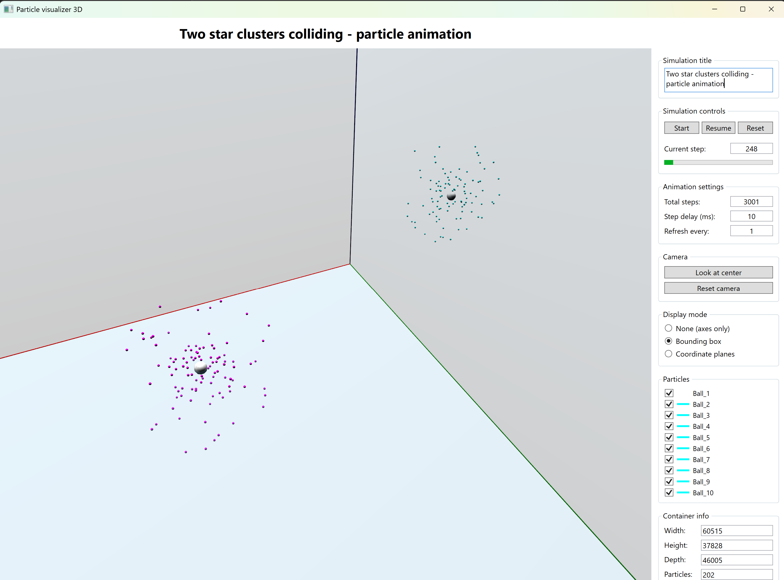
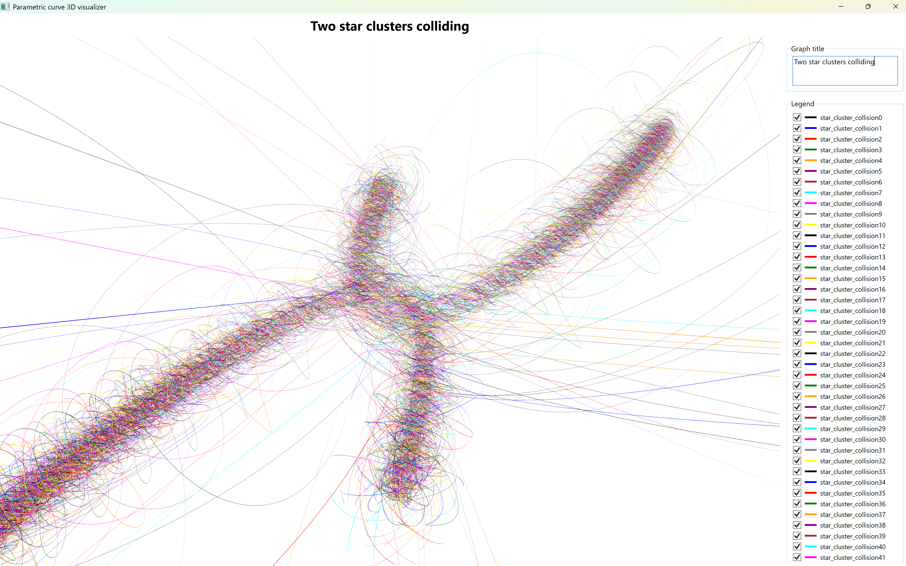
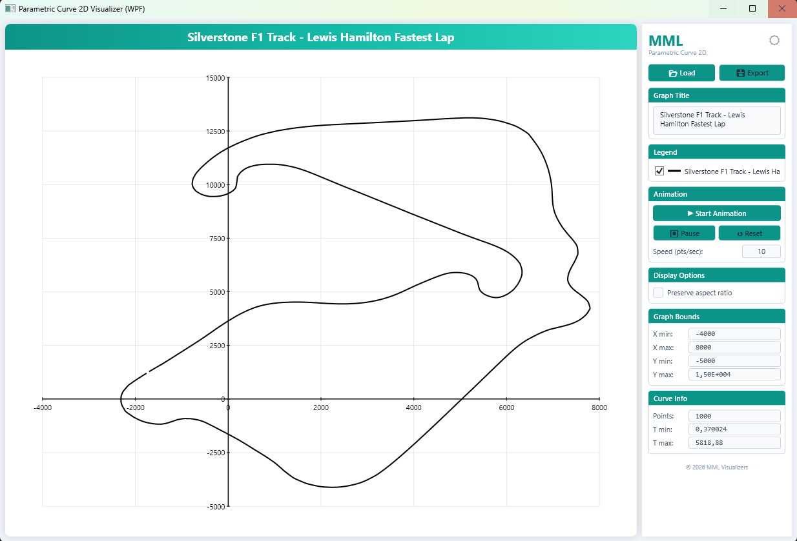
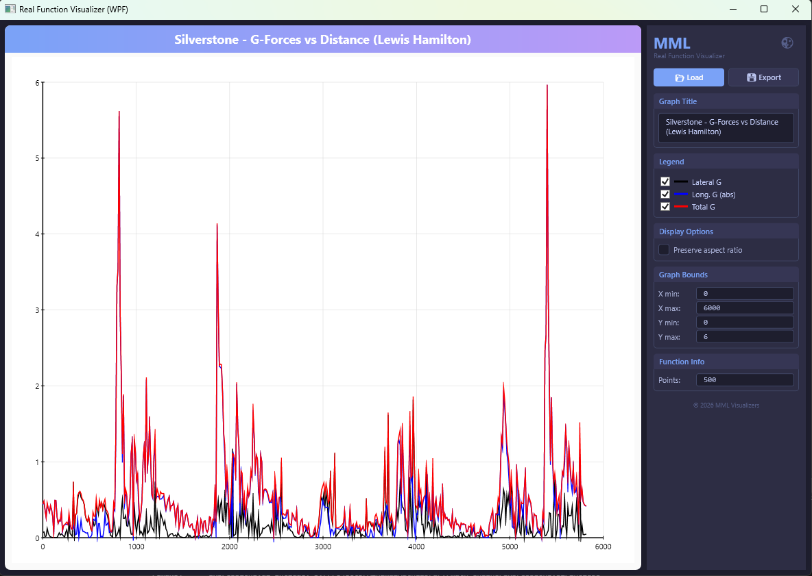
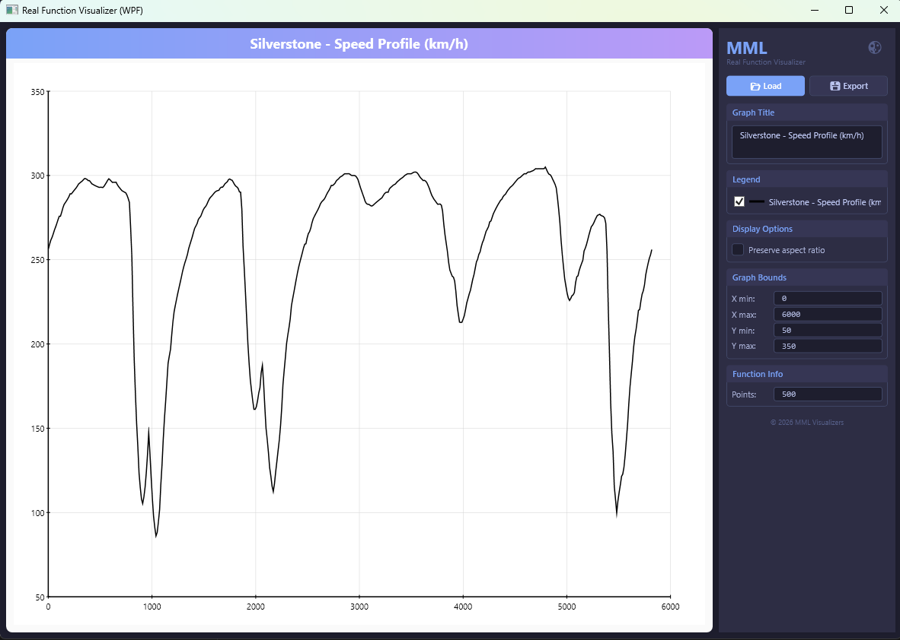
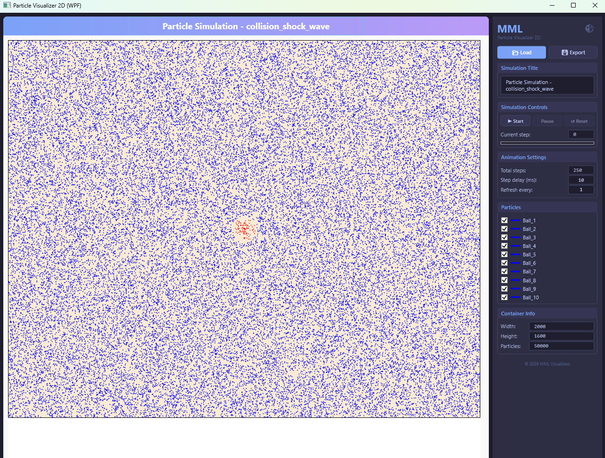
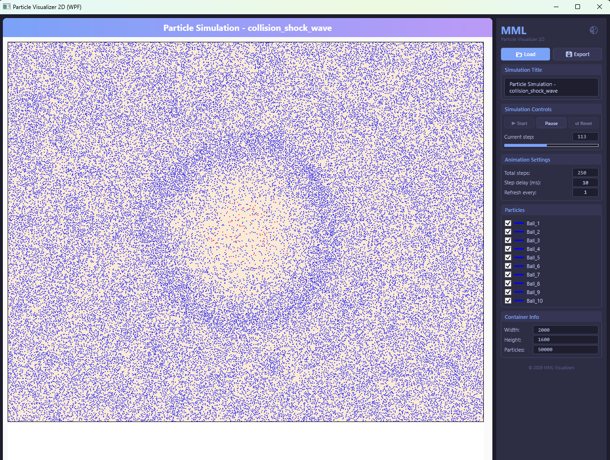
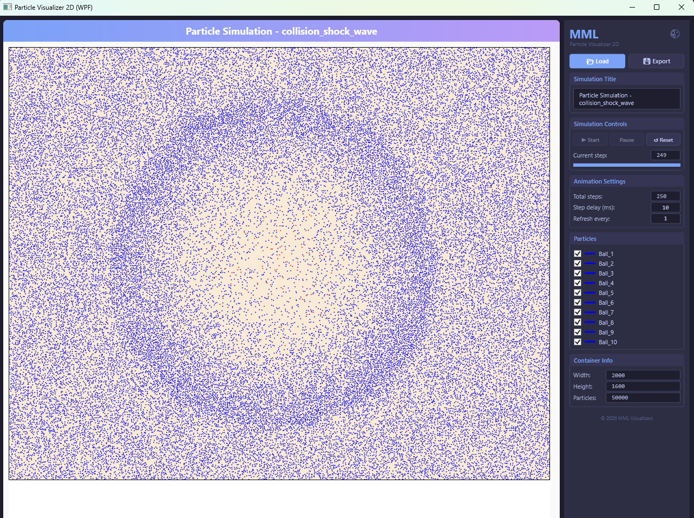

<div align="center">

# 🔢 MML 2.0 — Minimal Math Library

### **The Complete C++ Numerical Computing Toolkit**

*100,000+ lines of numerical computing • one `#include` • cross-platform visualization included*

[](https://github.com/zvanjak/MinimalMathLibrary/actions?query=workflow%3AUbuntu)
[](https://github.com/zvanjak/MinimalMathLibrary/actions?query=workflow%3AWindows)
[](https://github.com/zvanjak/MinimalMathLibrary/actions?query=workflow%3AmacOS)
[](https://isocpp.org/std/the-standard)
[](mml/single_header/MML.h)
[](tests/)
[](LICENSE.md)
[](https://minimal-math.library.org)

**🚀 Just `#include <MML.h>` and compute** — vectors, matrices & tensors; dense & sparse linear algebra; ODE & DAE solvers; derivation and integration; optimization and Fourier algorithms; computational geometry and more.

[Official Website](https://minimal-math.library.org) • [Quick Start](#-quick-start) • [Installation](#installation-options) • [What's Inside](#-whats-inside) • [New in 2.0](#-new-in-20) • [Serialization](#-serialization--persistence) • [Visualization](#-visualization-suite) • [Docs](#-documentation)

</div>

---

<div align="center">

### 📊 MML 2.0 by the Numbers

| | | |
|:--:|:--:|:--:|
| **100,000+** | **334** | **174,147** |
| lines of numerical code | modular headers | assertions (4,365 cases in 173 files) |
| **13** | **3** | **0** |
| subsystem families | platforms (Win/Linux/Mac) | external dependencies |

*One `MML.h` single header (100K lines) — or include only what you need.*

</div>

---

## 🎯 What is MML?

MML is a **comprehensive, single-header C++ numerical computing toolkit**. With one `#include <MML.h>` you get an entire computational stack — from vectors and matrices to **tensor calculus on manifolds**, from **dense and sparse** linear algebra to **stiff DAE solvers**, from adaptive integration to **Fourier and spectral BVP methods**, from **computational geometry** to **cross-platform visualization**.

<table>
<tr>
<td width="50%">

### The Problem

Most C++ math libraries require complex build systems, multiple linked libraries, platform-specific configuration, and steep learning curves — often wasting hours on setup (or precious AI tokens today) before writing actual code . 
And when you need to *see* your results, you reach for a second toolchain entirely.

</td>
<td width="50%">

### The MML Solution

```cpp
#include <MML.h>
// That's it. Start computing.
```

- ✅ **100K lines** in a single header, pure C++20
- ✅ Zero dependencies; Windows, Linux, Mac
- ✅ **174,147 assertions** across 4,365 test cases validate every algorithm
- ✅ Visualization & persistence **built in**

</td>
</tr>
</table>

You can also use MML piece-wise by including only selected headers from the `mml/` directory.

---

## 🏛️ Design Philosophy

<table>
<tr>
<td align="center" width="25%">

### 🎯 Completeness

An **entire numerical stack** — 100K lines spanning 13 subsystem families — behind one intuitive, header-only API.

</td>
<td align="center" width="25%">

### 🔬 Correctness

**174,147 assertions** across 4,365 test cases validate against analytical solutions.

</td>
<td align="center" width="25%">

### 📊 Visualization

**Cross-platform viewers** (WPF/Qt/FLTK) for functions, surfaces, fields, curves, and particle systems — launched from code.

</td>
<td align="center" width="25%">

### 💾 Persistence

A **new serialization framework** — durable `.mmlj`/`.mmlb` object round-trips plus rich data loading and export.

</td>
</tr>
</table>

### Flagship Example: Verify Gauss's Divergence Theorem

Gauss's divergence theorem connects a field's behavior inside a volume with the flux through its boundary:

$$
\iiint_V (\nabla \cdot F)\,dV = \iint_{\partial V} F \cdot \hat{n}\,dS
$$

For the unit cube and $F(x,y,z)=(x^2,y^2,z^2)$, the divergence is $2x+2y+2z$, so the exact volume integral is $3$. MML computes the divergence numerically, integrates it over the cube, independently computes the surface flux, and compares the two results.

📄 *[View full source](src/code_examples/readme00_fundamental_theorems.cpp)*

```cpp
// Verify ∫∫∫(∇·F)dV = ∮∮(F·n̂)dS over a unit cube, F(x,y,z) = (x², y², z²)
VectorFunction<3> F([](const VectorN<Real, 3>& p) {
    return VectorN<Real, 3>{ p[0]*p[0], p[1]*p[1], p[2]*p[2] };
});

// Divergence computed NUMERICALLY — MML calculates ∇·F automatically
ScalarFunctionFromStdFunc<3> divF([&F](const VectorN<Real, 3>& p) {
    return VectorFieldOperations::DivCart<3>(F, p);
});

auto y_lo = [](Real){ return 0.0; };  auto y_hi = [](Real){ return 1.0; };
auto z_lo = [](Real,Real){ return 0.0; };  auto z_hi = [](Real,Real){ return 1.0; };
Real volIntegral = Integrate3D(divF, GAUSS10, 0, 1, y_lo, y_hi, z_lo, z_hi).value;

Cube3D unitCube(1.0, Point3Cartesian(0.5, 0.5, 0.5));
Real surfIntegral = SurfaceIntegration::SurfaceIntegral(F, unitCube, 1e-8);

std::cout << "Volume:  " << volIntegral  << "\n";   // 3.0000000000
std::cout << "Surface: " << surfIntegral << "\n";   // 3.0000000000
std::cout << "Error:   " << std::abs(volIntegral - surfIntegral) << "\n"; // ~9.8e-15 ✓
```

---

## 🚀 Quick Start

### Installation options

**Option 1 — Single header**
```bash
curl -O https://raw.githubusercontent.com/zvanjak/MinimalMathLibrary/master/mml/single_header/MML.h
# then:  #include <MML.h>
```

**Option 2 — CMake FetchContent**
```cmake
include(FetchContent)
FetchContent_Declare(
    minimalmathlib
    GIT_REPOSITORY https://github.com/zvanjak/MinimalMathLibrary.git
    GIT_TAG        master  # or a tagged release, e.g. v2.0.0 when available
)
FetchContent_MakeAvailable(minimalmathlib)

target_link_libraries(my_app PRIVATE minimalmathlib::minimalmathlib)
```

**Option 3 — Full repository build**
```bash
git clone https://github.com/zvanjak/MinimalMathLibrary.git
cd MinimalMathLibrary && cmake -B build && cmake --build build
```

Full repository clones include prebuilt visualizers under `tools/visualizers` for Windows,
Linux, and macOS, so the visualization examples can run without a separate visualizer install.
This clone-mode bundle is in addition to the standalone visualizer release archives. The bundled
visualizer binaries are licensed separately from MML core; see
[`tools/visualizers/LICENSE.md`](tools/visualizers/LICENSE.md). The macOS visualizer apps are large
and add roughly 1 GB to the checkout.


**Option 4 — vcpkg overlay port**
```powershell
git clone https://github.com/zvanjak/MinimalMathLibrary.git
vcpkg install minimalmathlib --overlay-ports=MinimalMathLibrary\ports
```

Then use the exported CMake target:
```cmake
find_package(minimalmathlib CONFIG REQUIRED)
target_link_libraries(my_app PRIVATE minimalmathlib::minimalmathlib)
```

The current overlay port is repository-local and uses the checked-out source tree. Official vcpkg registry submission is planned after the 2.0 release is tagged.

**Option 5 — VS Code:** `Git: Clone` the repo, install recommended extensions (C/C++, CMake Tools), then `CMake: Configure` and build.

### First Program

```cpp
#include <MML.h>
using namespace MML;

int main() {
    Matrix<Real> A{3, 3, { 4,  1,  2,
                           1, -5, -3,
                          -1,  1,  6}};
    Vector<Real> b{1, 4, -3};

    LUSolver<Real> solver(A);
    Vector<Real> x = solver.Solve(b);

    std::cout << "Solution: " << x << std::endl;
    std::cout << "Residual: " << (A * x - b).NormL2() << std::endl;
    std::cout << "Determinant: " << solver.det() << std::endl;

    auto eigenResult = EigenSolver::Solve(A);
    std::cout << "Eigenvalues:" << std::endl;
    for (const auto& eigenvalue : eigenResult.eigenvalues)
        std::cout << "  " << eigenvalue << std::endl;

    return 0;
}
/* Expected OUTPUT:
Solution: [   0.5378151261,   -0.4957983193,   -0.3277310924]
Residual: 0.0000000000
Determinant: -119.0000000000
Eigenvalues:
   4.8937181442 + 0.9530217116i
   4.8937181442 - 0.9530217116i
  -4.7874362884 + 0.0000000000i
*/
```

```bash
g++ -std=c++20 -O3 myprogram.cpp -o myprogram
```

**Where next?** Two documents take you from here:
[**Fundamentals**](docs/Fundamentals.md) — the five ideas behind every MML API (precision builds, concepts, the function-interface hierarchy, Config + Result, library-wide contracts)
[**Cookbook**](docs/COOKBOOK.md) — task-oriented recipes (solve a linear system, find all roots, ...), every one backed by compiled, runnable code in `src/docs_demos/`

---

## 🧩 What's Inside

```
┌──────────────────────────────────────────────────────────────────────────────┐
│                          MML.h  (single header, 100K LOC)                     │
├──────────────────────────────────────────────────────────────────────────────┤
│  mml/                                                                         │
│  ├── base/        Vectors, Matrices, Sparse Matrices, Tensors, Functions,     │
│  │                Polynomials, Quaternions, Geometry, Function Objects        │
│  ├── core/        Derivation, Integration, Dense & Sparse Solvers, Fields,    │
│  │                Coord Transforms, Metric Tensors, Function Spaces, Vec Spaces│
│  ├── algorithms/  ODE & DAE Solvers, Root Finding, Optimization, Eigen,       │
│  │                Fourier, Interpolation, Computational Geometry, Statistics  │
│  ├── systems/     Dynamical Systems, Attractors, Lyapunov, Bifurcation        │
│  ├── interfaces/  Abstract interfaces for functions, systems, tensors         │
│  └── tools/       Visualization, Serialization framework, Data loading        │
└──────────────────────────────────────────────────────────────────────────────┘
```

The public API follows five implementation layers. Abstract contracts in `mml/interfaces/` support all five rather than forming a separate feature layer.

### 🧱 Base Layer — Mathematical Foundations

| Facility | What it provides |
|----------|------------------|
| [**Algebra & discrete mathematics**](docs/base/Algebra.md) | Groups, finite fields, permutations, representations, modular arithmetic, combinatorics, number theory, and graphs |
| [**Vectors**](docs/base/Vectors.md) | Dynamic and fixed-size vectors plus coordinate-vector types |
| [**Matrices**](docs/base/Matrices.md) | Dynamic and fixed-size matrices plus specialized symmetric, tridiagonal, and band storage |
| [**Sparse matrices**](docs/base/SparseMatrices.md) | COO, CSR, and CSC storage for large sparse problems |
| [**Tensors & differential forms**](docs/base/Tensors.md) | Rank 1-5 tensors, tensor fields, tangent/cotangent objects, forms, and Hodge operations |
| [**Functions**](docs/base/Functions.md) | Real, scalar, vector, and parametric function objects |
| [**Interpolation**](docs/base/Interpolated_functions.md) | Linear, polynomial, spline, Akima, Hermite, barycentric, and rational interpolation |
| [**Polynomials & scalar structures**](docs/base/Polynoms.md) · [**Intervals**](docs/base/Intervals.md) | Generic polynomials, Chebyshev approximation, rational numbers, intervals, special functions, and Richardson extrapolation |
| [**Geometry 2D & 3D**](docs/base/Geometry.md) | 2D/3D primitives and bodies, bounding volumes, spherical geometry, and rigid motions |
| [**Quaternions**](docs/base/Quaternions.md) | Quaternion types and rotations |
| [**Random & quasi-random sequences**](docs/base/Random.md) | Pseudorandom generators, distributions, and low-discrepancy sampling |

### ⚙️ Core Layer — Operations on Mathematical Objects

| Facility | What it provides |
|----------|------------------|
| [**Algebra algorithms**](docs/core/Algebra.md) | Finite-group algorithms, group actions, polynomial arithmetic, representations, and algebra/geometry integration |
| [**Vector spaces**](docs/core/Vector_spaces.md) · [**Function spaces**](docs/core/Function_spaces.md) | Bases, subspaces, dual and inner-product spaces, linear maps/operators, trial spaces, collocation, and 1D BVP machinery |
| [**Numerical derivation**](docs/core/Derivation.md) | First through third derivatives, gradients, Jacobians, Hessians, automatic differentiation, and O(h) to O(h⁸) stencils |
| [**Numerical integration**](docs/core/Integration.md) · [**Multidimensional**](docs/core/Multidim_integration.md) | Newton-Cotes, Romberg, Gaussian and adaptive quadrature, improper integrals, and 2D/3D integration |
| [**Dense linear solvers**](docs/core/Linear_equations_solvers.md) | LU, QR, SVD, Cholesky, and dense linear-system diagnostics |
| [**Sparse solvers**](docs/algorithms/SparseSolvers.md) | CG, BiCGSTAB, GMRES, and preconditioners for sparse systems |
| [**Fields**](docs/core/Fields.md) · [**Field operations**](docs/core/Field_operations.md) | Scalar/vector/tensor fields; gradient, divergence, curl, Laplacian, and common physical field models |
| [**Coordinates**](docs/core/Coordinate_transformations.md) · [**Metrics**](docs/core/Metric_tensor.md) | Coordinate maps and transformations, frames, atlases/charts, metric tensors, induced metrics, and differential-form integration |
| [**Curves & surfaces**](docs/core/Curves_and_surfaces.md) | Parametric geometry, predefined shapes, tangent frames, curvature, and surface operations |
| [**Orthogonal bases**](docs/core/OrthogonalBases.md) | Legendre, Chebyshev, Hermite, and Laguerre bases with quadrature and spectral support |
| [**Complex analysis**](docs/core/ComplexAnalysis.md) | Complex functions, derivatives, contour integration, winding numbers, residues, and argument-principle tools |

### 🧠 Algorithms Layer — Problem Solvers & Analysis

| Facility | What it provides |
|----------|------------------|
| [**Matrix analysis**](docs/algorithms/MatrixAnalysisContracts.md) · [**Eigensolvers**](docs/algorithms/Eigen_solvers.md) | Matrix properties and decompositions, symmetric/general eigensystems, and linear-system diagnostics |
| [**Root finding**](docs/algorithms/Root_finding.md) | Bracketing, Bisection, Brent, Newton, Ridders, polynomial/complex roots, all-real-roots isolation, and nonlinear systems |
| [**ODE solvers**](docs/algorithms/Differential_equations_solvers.md) | Fixed/adaptive explicit methods, Backward Euler, and event detection |
| [**DAE solvers**](docs/algorithms/DAE_SOLVERS.md) | BDF2/BDF4, Radau IIA, RODAS, and stiff differential-algebraic systems |
| [**Optimization**](docs/algorithms/Optimization.md) | One-dimensional and multidimensional optimization, simplex LP, Nelder-Mead, Powell, quasi-Newton, and constrained methods |
| [**Fourier & spectral algorithms**](docs/algorithms/Fourier.md) | FFT/real FFT, DCT, spectra, convolution, filtering, and windowing |
| [**Approximation & curve fitting**](docs/algorithms/Approximation_and_curve_fitting.md) | Adaptive Chebyshev approximation, linear/nonlinear least squares, weighted fitting, and regularization |
| [**Computational geometry**](docs/algorithms/CompGeometry.md) | Convex hulls, Delaunay triangulation, Voronoi diagrams, KD-trees, polygon operations, and robust predicates |
| [**Graph algorithms**](docs/algorithms/GraphAlgorithms.md) | Traversals, connectivity, shortest paths, DAG structure, spanning trees, flows, matching, coloring, and matrix conversions |
| [**Statistics**](docs/algorithms/Statistics.md) | Continuous/discrete distributions, descriptive and robust statistics, histograms, correlation, and sampling |
| [**Function analysis**](docs/algorithms/Function_analyzer.md) | Roots, extrema, inflection points, continuity, monotonicity, and scalar/vector field analysis |
| [**Path integration**](docs/algorithms/Path_integration.md)  · [**Surface integration**](docs/algorithms/SurfaceIntegration.md) | Line/surface/volume integrals and flux calculations |
| [**Differential geometry**](docs/algorithms/Differential_geometry.md) | Curvature, geodesics, tensor geometry, and relativity support |

### 🌐 Systems Layer — Mathematical Systems

| Facility | What it provides |
|----------|------------------|
| [**Linear systems**](docs/systems/LinearSystem.md) | First-class `Ax=b` models, solver orchestration, residuals, conditioning, and diagnostics |
| [**Continuous dynamical systems**](docs/systems/DynamicalSystem.md) | Lorenz, Rössler, Van der Pol, pendulum, Hamiltonian, and user-defined continuous systems |
| [**Discrete maps**](docs/systems/DynamicalSystem.md) | Logistic, Hénon, standard, tent, and user-defined iterated maps |
| [**Dynamical-system analysis**](docs/systems/DynamicalSystem.md) | Fixed points and stability, Lyapunov spectra, attractors, phase portraits, Poincaré sections, and bifurcations |

### 🛠️ Tools Layer — Persistence, Presentation & Runtime Support

| Facility | What it provides |
|----------|------------------|
| [**Persistence & serialization**](docs/tools/SerializationPersistence.md) | Versioned JSON/binary round-trips for mathematical objects plus simulation and visualizer export |
| [**Visualization**](docs/tools/Visualizers.md) | Cross-platform plotting of functions, fields, curves, surfaces, particles, and rigid-body simulations |
| [**Console & export**](docs/tools/ConsolePrinter.md) | Styled tables and TXT, CSV, JSON, HTML, LaTeX, and Markdown export |
| [**Data loading**](docs/tools/SerializationPersistence.md) | CSV, TSV, JSON, and text loading with type inference, date/time handling, and structured I/O results |
| [**Runtime utilities**](docs/tools/Timer_ThreadPool.md) | Timers, thread pools, asynchronous task execution, and exception propagation |

---

## ✨ New in 2.0

MML 2.0 is a **massive** expansion over the last official 1.2.1 release:

- **🧮 Sparse linear algebra** — `SparseMatrixCOO/CSR/CSC` with Krylov solvers (CG, BiCGSTAB, GMRES) and preconditioners.
- **🌐 DAE solvers** — stiff differential-algebraic systems raised to full ODE-solver quality: Radau IIA, BDF2/BDF4, RODAS, Backward Euler, adaptive stepping, and event detection.
- **🔺 Computational geometry** — convex hull (2D/3D), Delaunay triangulation, Voronoi diagrams, KD-trees, polygon clipping, and robust geometric predicates.
- **📈 Function spaces & spectral methods** — Chebyshev collocation, orthogonal bases (Legendre, Chebyshev, Hermite, Laguerre), trial spaces, linear operators, and 1D boundary-value-problem solvers.
- **🧊 Vector spaces** — abstract `Basis`, `Subspace`, `DualSpace`, `LinearMap`, `InnerProductSpace`, and affine spaces.
- **🧠 Complex analysis** — complex functions, complex root finding, contour integration, and residues.
- **📊 Statistics** — continuous/discrete distributions, histograms, and descriptive statistics (inferential statistics — hypothesis tests, confidence intervals, rank correlation — live in MML-Packages).
- **🌊 Fourier suite** — real FFT, spectrum analysis, convolution, and windowing.
- **💎 Tensors & relativity** — Minkowski/Lorentzian metrics with timelike/spacelike/null interval classification.
- **💾 Serialization framework** — durable object persistence (see below).
---

## 💾 Serialization & Persistence

MML 2.0 introduces a **first-class serialization framework** under `mml/tools/serializer/` — durable object round-trips plus rich presentation export and data loading.

| Format | Extension | Purpose | Human-readable |
|--------|-----------|---------|:--:|
| **MML JSON object** | `.mmlj` | Structured object persistence (schema + metadata) | ✅ |
| **MML binary object** | `.mmlb` | Compact, exact binary payloads | — |
| **Visualizer export** | `.mml` | Presentation files for functions, curves, fields, ODE, particles | ✅ |
| **Data helpers** | `.csv`, `.json`, `.txt` | Load/inspect tabular data | ✅ |

```cpp
#include <mml/tools/Serializer.h>
using namespace MML;

Vector<Real> v{1.25, -2.5, 3.75};

// Durable round-trip — format inferred from extension (.mmlj JSON, .mmlb binary)
Serializer::Save(v, "vector.mmlj");
Vector<Real> loaded;
Serializer::Load("vector.mmlj", loaded);
```

Dedicated serializers cover functions, curves, surfaces, vector fields, field lines, ODE solutions, and particle simulations; the `data_loader` module reads CSV, TSV, and JSON datasets (with DATE/TIME support). See **[Serialization & Persistence](docs/tools/SerializationPersistence.md)**.

---

## 📊 Visualization Suite

Cross-platform visualizers for functions, fields, curves, surfaces, and particle systems — Windows (WPF), Linux (Qt), macOS (Qt), with FLTK for lightweight 2D. Launched directly from code, no manual export needed. Full gallery, per-platform screenshots, and code: **[docs/README_Visualization_suite.md](docs/README_Visualization_suite.md)**.

Prebuilt visualizer binary packaging for Windows, Linux, and macOS is planned separately from the header-only core package flow. For now, build visualizer demos from source with the repository.

| Windows (WPF) | Linux (Qt) | macOS (Qt) |
|:-------------:|:----------:|:----------:|
|  |  |  |

Ready-to-run demos: [`src/visualization_examples/`](src/visualization_examples/).

---

## 📝 Code Examples

Concise, copy-pasteable snippets for the core API live in **[docs/README_Code_examples.md](docs/README_Code_examples.md)**:

- [Vectors & Matrices](docs/README_Code_examples.md#vectors--matrices) · [Linear Systems & Eigenvalues](docs/README_Code_examples.md#linear-systems--eigenvalues) · [Polynomials & Algebra](docs/README_Code_examples.md#polynomials--algebra)
- [Defining Functions](docs/README_Code_examples.md#defining-functions) · [Interpolation](docs/README_Code_examples.md#interpolation) · [Numerical Derivatives](docs/README_Code_examples.md#numerical-derivatives) · [Numerical Integration](docs/README_Code_examples.md#numerical-integration)
- [Root Finding](docs/README_Code_examples.md#root-finding) · [Field Operations](docs/README_Code_examples.md#field-operations) · [Coordinate Transformations](docs/README_Code_examples.md#coordinate-transformations) · [Parametric Curves](docs/README_Code_examples.md#parametric-curves)
- [Path & Line Integrals](docs/README_Code_examples.md#path--line-integrals) · [Function Analysis](docs/README_Code_examples.md#function-analysis) · [Differential Equations](docs/README_Code_examples.md#differential-equations) · [Dynamical Systems](docs/README_Code_examples.md#dynamical-systems-analysis)

Full compilable sources are in [`src/code_examples/`](src/code_examples/).

---

## 🧪 Usage Examples — Physics Simulations

Self-contained, runnable physics simulations demonstrating MML in practice. Full gallery and code: **[docs/README_Usage_examples.md](docs/README_Usage_examples.md)**.

### 🌌 [Example 00: N-Body Gravity](docs/examples/Example_00_N_body_gravity.md)

Star-cluster collision simulation with Newtonian gravity and multiple integrators.

<table>
<tr>
<td align="center" width="33%">



*Cluster overview*

</td>
<td align="center" width="33%">


*Cluster approach*

</td>
<td align="center" width="33%">


*Early interaction*

</td>
</tr>
<tr>
<td align="center" width="33%">


*Gravitational mixing*

</td>
<td align="center" width="33%">


*Post-encounter structure*

</td>
<td align="center" width="33%">



*Trajectory visualization*

</td>
</tr>
</table>

### 🏎️ [Example 03: Formula 1 G-Force Analysis](docs/examples/Example_03_F1_GForce_analysis.md)

Real telemetry data analyzed with parametric curves, curvature, speed, and lateral/longitudinal G-force calculations.

<table>
<tr>
<td align="center" width="33%">



*Track layout from telemetry*

</td>
<td align="center" width="33%">



*G-force profile around lap*

</td>
<td align="center" width="33%">



*Speed profile analysis*

</td>
</tr>
</table>

### 💥 [Example 04: 2D Collision Simulator](docs/examples/Example_04_collision_simulator_2d.md)

Large-scale elastic collision simulation with spatial partitioning, parallel execution, and shock-wave propagation.

<table>
<tr>
<td align="center" width="33%">



*Initial shock front*

</td>
<td align="center" width="33%">



*Wave propagation*

</td>
<td align="center" width="33%">



*Shock wave dispersion*

</td>
</tr>
</table>

More runnable simulations:

| # | Example | Topic |
|---|---------|-------|
| 01 | [**Projectile Launch**](docs/examples/Example_01_projectile_launch.md) | Ballistics with air resistance |
| 02 | [**Double Pendulum**](docs/examples/Example_02_double_pendulum.md) | Deterministic chaos, butterfly effect |
| 05 | [**Rigid Body Collisions**](docs/examples/Example_05_rigid_body.md) | 3D dynamics with quaternions |
| 06 | [**Lorentz Transformations**](docs/examples/Example_06_Lorentz_transformations.md) | Special relativity, worldlines & Twin Paradox |

```bash
cmake -B build && cmake --build build
./build/src/examples/Release/Example00_NBodyGravity   # Windows
./build/src/examples/Example00_NBodyGravity           # Linux
```

---

## 🔬 Precision & Testing

MML takes numerical accuracy seriously — every algorithm is validated against analytical solutions, with **174,147 assertions** in **4,365 test cases** across **173 registered test files**.

| Domain | Key Validations |
|--------|-----------------|
| **Linear Algebra** | LU/QR/SVD, eigensolvers, sparse Krylov solvers, condition numbers up to 10¹⁵ |
| **Calculus** | Derivation (orders 1-8), 1D/2D/3D integration, Gauss-Kronrod |
| **ODE & DAE** | All steppers, event detection, stiff systems (λ = -10⁶) |
| **Geometry** | 2D/3D primitives, convex hull, Voronoi, KD-tree, triangulation |
| **Fields & Diff. Geometry** | Gradient/divergence/curl, metric tensors, manifolds |
| **Root Finding** | Scalar methods, all-roots isolation, polynomial/complex, nonlinear Newton |

**Predefined test beds** (`TestBeds::`) provide battle-tested inputs: ill-conditioned matrices (Hilbert, Vandermonde, Kahan; κ = 10³–10¹⁵), stiff ODEs (Lorenz, Van der Pol, Robertson), singular/oscillatory integrands, and curves with analytical curvature.

**Precision benchmarks** — derivative of sin(x) at x=1.0: `NDer1` ~10⁻⁸ → `NDer8` ~10⁻¹⁵ (machine ε). Kepler orbit energy drift after 1000 periods: RK4 ~10⁻⁶, RKF45 ~10⁻¹², DP8(5,3) ~10⁻¹⁴.

```powershell
# Build, then run the complete Catch2 suite directly in one process
cmake --build build --config Debug --target MML_Tests --parallel
& .\build\tests\Debug\MML_Tests.exe

# Run related categories in one focused process
& .\build\tests\Debug\MML_Tests.exe '[integration],[interpolation]'
```

📚 **Precision Analysis Reports:** [Overview](docs/testing_precision/README.md) • [Derivation](docs/testing_precision/DERIVATION_ANALYSIS.md) • [Integration](docs/testing_precision/INTEGRATION_ANALYSIS.md) • [ODE Solvers](docs/testing_precision/ODE_SOLVER_ANALYSIS.md)

📁 **Test Bed Documentation:** [Functions](docs/testbeds/Functions_testbed.md) • [ODE Systems](docs/testbeds/ODESystems_testbed.md) • [Linear Systems](docs/testbeds/LinAlgSystems_testbed.md) • [Curves & Surfaces](docs/testbeds/ParametricCurvesSurfaces_testbed.md)

---

## ⚖️ How MML Compares to Other C++ Math Libraries

MML is benchmarked and compared in the companion repository
[ComparingCppMathLibs](https://github.com/zvanjak/ComparingCppMathLibs), alongside Boost, Eigen,
GSL, Armadillo, Blaze, MFEM, and Intel MKL. The results are intentionally practical: specialist
libraries often win their specialist benchmarks, while MML's advantage is breadth, cohesion, zero
runtime dependencies, and a single C++ API spanning many domains that usually require several
separate libraries.

| Library | Best at | Trade-off |
|---------|---------|-----------|
| **GSL** | Mature C scientific routines: interpolation, integration, roots, special functions, statistics | GPL license, C-style API, limited geometry/tensor/coordinate-system coverage |
| **Boost** | Powerful specialist modules: Boost.Math, Boost.Odeint, Boost.Geometry, Boost.QVM | Broad ecosystem rather than one cohesive numerical toolkit; Boost.uBLAS lags modern linear algebra libraries in benchmarks |
| **MML** | One dependency-free stack: vectors, matrices, sparse solvers, calculus, ODE/DAE, fields, tensors, geometry, graph algorithms, visualization, and persistence | Native implementations prioritize clarity, portability, and integration over BLAS/LAPACK-tuned peak dense linear algebra performance |

In the comparison suite, Armadillo/MKL/Eigen/Blaze lead many dense linear algebra benchmarks,
Boost.Math and Boost.Odeint lead several numerical-analysis categories, and GSL is especially strong
for interpolation. MML is most compelling when you want a broad, inspectable toolkit that works from
one include and carries mathematical objects across domains: for example from a vector field to a
divergence calculation, to a volume/surface integral, to a visualizer export.

Choose the specialist library when one narrow workload must be maximally tuned. Choose MML when setup
simplicity, API consistency, source readability, and cross-domain mathematical coverage matter more.

---

## 💎 Pro Extensions

> **Unlock advanced capabilities** with our commercial add-on packages.

### 📦 MML Packages

**Domain-specific numerical libraries** extending core MML functionality.

| Package | Capabilities |
|---------|-------------|
| **Optimization** | Genetic algorithms, NSGA-II, MOEA/D, simulated annealing, revised simplex LP, constrained optimization |
| **PDE** | Finite differences, grids, Poisson/Heat/Wave equation solvers |
| **Fourier** | FFT, DFT, DCT, spectral analysis, windowing functions |
| **Statistics** | Hypothesis testing, confidence intervals, rank correlation, time series, data descriptors |
| **Symbolic** | Automatic differentiation, expression trees, symbolic manipulation |
| **mml_ext** | MML extension tree: spectral graph analytics (PageRank, centralities), field line tracing |

[Learn more about MML Packages →](https://github.com/zvanjak/MML-Packages)

---

### Σ Sigma Engine

```
███████╗██╗ ██████╗ ███╗   ███╗ █████╗ 
██╔════╝██║██╔════╝ ████╗ ████║██╔══██╗
███████╗██║██║  ███╗██╔████╔██║███████║
╚════██║██║██║   ██║██║╚██╔╝██║██╔══██║
███████║██║╚██████╔╝██║ ╚═╝ ██║██║  ██║
╚══════╝╚═╝ ╚═════╝ ╚═╝     ╚═╝╚═╝  ╚═╝
```

**Interactive Mathematical Expression Engine** for runtime computation with **C++ code generation**.

| Feature | Description |
|---------|-------------|
| **Expression Parsing** | Parse & evaluate mathematical expressions in real-time |
| **Session State** | Variables, constants, persistent state across evaluations |
| **User Functions** | Define custom functions: `func f(x,y) = x^2 + y^2` |
| **Typed Functions** | `scalarfunc f(v:3) = norm(v)`, `vectorfunc F(v:3) = v/norm(v)` |
| **Built-in Library** | 40+ functions: trig, exp, log, special functions |
| **Data Types** | Scalars, vectors, matrices, polynomials |
| **Save/Load** | Save sessions to `.sigma` files and reload them |
| **C++ Code Gen** | Live preview of your session as generated C++ code |

SigmaEngine in action:

<p align="center">
    
</p>

[Learn more about Sigma Engine →](https://github.com/zvanjak/SigmaEngine)

---

## 📚 Documentation

| Resource | Description |
|----------|-------------|
| [🌐 Official Website](https://minimal-math.library.org) | Public home for MML: overview, docs entry points, examples, and project news |
| [🎯 Fundamentals](docs/Fundamentals.md) | **Start here** — the five ideas behind every MML API: `Real`/precision builds, concepts (`MMLScalar`, `Field`), function interfaces, Config + Result, library-wide contracts |
| [🍳 Cookbook](docs/COOKBOOK.md) | Task-oriented recipes (linear systems, root finding, ...) — every snippet backed by runnable code in `src/docs_demos/` |
| [Base Types](docs/base/README_Base.md) | Vectors, Matrices, Sparse Matrices, Tensors, Functions |
| [Core Operations](docs/core/README_Core.md) | Derivation, Integration, Solvers, Fields, Function Spaces |
| [Algorithms](docs/algorithms/README_Algorithms.md) | ODE/DAE Solvers, Root Finding, Optimization, Geometry |
| [Systems](docs/systems/) | Dynamical Systems, Phase Space, Stability |
| [Tools](docs/tools/) | Visualization, Serialization, Data Loading |
| [Code Examples](docs/README_Code_examples.md) · [Usage Examples](docs/README_Usage_examples.md) · [Visualization](docs/README_Visualization_suite.md) | Snippets, physics sims, viz gallery |
| [📖 Book References](docs/references/book_references.md) · [📄 Paper References](docs/references/paperes_references.md) | Textbooks and papers behind the algorithms |


---

## 🛠️ Building & Testing

```powershell
cmake -B build
cmake --build build

# Run all tests directly in one process
& .\build\tests\Debug\MML_Tests.exe

# Build examples
cmake --build build --target examples
```

---

## 📄 License

MML core is released under the **[MIT License](LICENSE.md)** — free for personal, academic, and commercial use.

Prebuilt MML Visualizers bundled under [`tools/visualizers`](tools/visualizers) are provided for
clone-mode convenience and are licensed separately under the
**[MML Visualizers License](tools/visualizers/LICENSE.md)**: free for personal and educational use;
commercial use requires a paid license. See [NOTICE.md](NOTICE.md) for the repo-level license
boundary.

---

## ☕ Support MML

If MML has been useful to you, consider [sponsoring its continued development](https://github.com/sponsors/zvanjak). Your support helps maintain and improve MML! 🚀

<div align="center">

**Made with ❤️ for the C++ scientific computing community**

**🔢 MML 2.0 — Minimal Math Library** · *100,000+ lines. One `#include`. Just compute.*

[⬆ Back to Top](#-mml-20--minimal-math-library)

</div>
