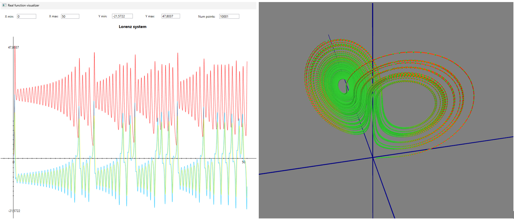

# MML - Minimal Math Library
All your basic (numerical) math needs, contained in a single-header file (more clickbaitish title would be Numerical Recipes on Steroids).

## MML Vision
- For a C++ developer, on Windows, Mac or Linux
- Who needs a math library to perform simple (and not so simple) numerical calculations 
- The Minimal Math Library is a general purpose, pythonesque in its focus on simplicity of use, single-header C++ library of classes and functions
- That is trivial to use in any kind of project, is C++ 20 cross-platform compatible, and comes with a rich set of functionalities for working with vectors, matrices, tensors, linear systems, polynoms, real, scalar and vector functions, coordinate systems and their transformations, 2D & 3D geometry with algorithms for derivation, integration, interpolation, differential equations solving, root finding, statistics, and more.

## Basic facts
- As of now, and for foreseable future, this is unfortunately strictly for personal, research and educational use only (see Licensing at the end)
- Single-header  - get MML.h, include in your project and go 
- Cross-platform - tested with Visual Studio Code on Windows (MSVC++, clang), Mac (gcc, clang), Linux (gcc)
- C++20 standard - but can easily be adapted to C++17, C++14
- Pythonesque in its focus on simplicity of use, and focused on faithful modeling of mathematical entities (while trying as much as possible to retain C++ computational efficiency)
- Currently, visualizators are available only on Windows platform
- Console based demo and example apps are CMake based, and should work out of the box on Windows, Mac and Linux if you are using Visual Studio Code

**Is there really a need for another C++ math library?**
- Main benefit, and the reason I did all this is attempt at completeness, and simplicity of use (also, tensors ❤️).
- Not hard focused on efficiency so when going gets rough - Boost, Eigen, Armadillo, etc.

## Organization

Library is organized in three main groups (you could call them layers), with addition of visualizers as external tools.

**Base**

Basic math types. These are the building blocks of the library, sitting at the lowest layer, depending only on standard library headers (and possibly Vector and Matrix class), and are used in all other parts of the library. 
- [Vectors](/docs/base/Vectors.md) - Vector, VectorN<int N>, Vector(2)(3)Cartesian, Vector2Polar, Vector3Spherical, Vector3Cylindrical
- [Matrices](/docs/base/Matrices.md) - Matrix, MatrixNM<int N, int M>, MatrixSym, MatrixTridiag, MatrixBandDiag
- [Tensors](/docs/base/Tensors.md) - Tensor2<int Dim>, Tensor3<int Dim>, Tensor4<int Dim>, Tensor5<int Dim> in N dimensions
- [Polynoms](/docs/base/Polynoms.md) - general Polynom class (tested for Real, Complex and Matrix as field type)
- [Geometry](/docs/base/Geometry.md) - pure geometry: points, triangles
- [2D & 3D geometry](/docs/base/Geometry_2D_3D.md) - analytic geometry in 2D and 3D
- [Vector spaces](/docs/base/Vector_spaces.md) - vector space, normed vector space, metric (Hilbert) space (still much to do here!)
- [Functionals, operators, quadratic forms](/docs/base/Operators.md)  - linear functional, quadratic form, linear operator (much to do here!)
- [Standard functions](/docs/base/Standard_functions.md) - definition of available standard functions
- [Base utils](/docs/base/BaseUtils.md) - general utilities including matrix helper (IsOrthogonal, IsUnitary, IsHermitian)
- [Algebra](/docs/base/Algebra.md) - groups, permutation group (big TODO!)

**Core**

Core mathematical objects and operations of the library, depending on Base types, and used by MML algorithms.
Function objects, and different algorithms for working with them are the heart of this layer.
- [Linear alg. equations solvers](/docs/core/Linear_equations_solvers.md) - GJ, LU, QR, SVD, Cholesky
- [Functions](/docs/core/Functions.md) - IRealFunction, IScalarFunction<int N>, IVectorFunction<int N>, IParametricCurve<N>, IParametricSurface<N>, ITensorField<N>
- [Interpolated functions](/docs/core/Interpolated_functions.md) - linear, polynomial, rational polynomial, spline interpolations
- [Dirac delta function](/docs/core/Dirac_delta_function.md)- predefined distributions for representing Dirac delta function
- [Curves & Surfaces](/docs/core/Curves_and_surfaces.md) - predefined curves and surfaces
- [Fields](/docs/core/Fields.md) - predefined example fields
- [Numerical derivation](/docs/core/Derivation.md) - orders 1, 2, 4, 6, 8 for IRealFunction, IScalarFunction, IVectorFunction, IParametricCurve, IParametricSurface, ITensorField
- [Field operations](/docs/core/Vector_field_operations.md) - grad, div, curl, Laplacian in general, Cartesian, cylindrical and spherical coordinates
- [Numerical integration](/docs/core/Integration.md) - Trapezoidal, Simpson, Romberg basic integration algorithms
- [Multidim integration](/docs/core/Multidim_integration.md) - calculating 2D and 3D (cartesian) integrals
- [ODE system](/docs/core/ODE_system.md) - represents a dynamical system of ordinary differential equations
- [Coordinate transformations](/docs/core/Coordinate_transformations.md) - General, Cartesian, Cylindrical, Spherical  
- [Metric tensor](/docs/core/Metric_tensor.md) - predefined metric tensors in General, Cartesian, Cylindrical and Spherical coordinates
- [Function spaces](/docs/core/Function_spaces.md) - Hermitian, Legendre, Laguerre, Chebyshev, Fourier spaces (much to do here!)

**Algorithms**

Algorithms for solving mathematical problems. These are the algorithms of the library, depending on Base and Core types.
- [Eigen solvers](/docs/algorithms/Eigen_solvers.md) - solving eigenvalue problems for symmetric and non-symmetric real matrices
- [Path integration](/docs/algorithms/Path_integration.md) - calculating path integrals (curve len, line and work integrals)
- [ODE system solvers](/docs/algorithms/Differential_equations_solvers.md) - solvers for systems of ordinary differential equations
- [Differential geometry](/docs/algorithms/Differential_geometry.md) - for curves only, so far
- [Root finding](/docs/algorithms/Root_finding.md) - different root finding algorithms (bracketing, Newton-Raphson)
- [Statistics](/docs/algorithms/Statistics.md) - basics - avg, std, var, cov, corr
- [Function analyzer](/docs/algorithms/Function_analyzer.md) - analyzing functions, finding roots, extrema, inflection points, etc.
- [Fourier transformation](/docs/algorithms/Fourier_transformation.md) - TODO

**Visualizers**

Set of external tools, used for visualization of different types of functions. They are using as input files created by Serialize members of respective function types.
- [Real function visualizer](/docs/visualizers/RealFunction_visualizer.md) - visualizes real function in 2D
- [Parametric curve visualizer](/docs/visualizers/ParametricCurve_visualizer.md) - visualizes parametric curve in 3D
- [Surface visualizer](/docs/visualizers/Surface_visualizer.md) - visualizes cartesian 2D surface in 3D
- [Vector field visualizer](/docs/visualizers/VectorField_visualizer.md) - visualizes vector field in 3D

Example visualizations:

## Simple example of real use

I decided to try something with electromagnetism, because it nicely intersects special relativity (which I need to figure out first, before going to general theory, main objective of my research) with theory of tensors and differential forms, also my great interest, and I have chosen to calculate and visualize EM field of three infinite line currents.
~~~ c++
// simple structure modeling line current
struct LineCurrent {
    double _currentI;
    Line3D _line;
};
// class representing calculated EM vector field
class InfiniteLineCurrent_Field_B : public IVectorFunction<3>
{
    std::vector<LineCurrent> _lines;
public:
    void AddLine(double currentI, const Line3D &line) { _lines.push_back({currentI, line}); }

    VectorN<Real, 3> operator()(const VectorN<Real, 3> &x) const override  {
        VectorN<Real, 3>  ret;
        Point3Cartesian   pos(x[0], x[1], x[2]);

        // calculating contribution to B field of each line at given point
        for(int i=0; i<_lines.size(); i++) {
            Point3Cartesian  nearest_point = _lines[i]._line.NearestPoint(pos);
            Vector3Cartesian vec_to_pos (nearest_point, pos);
            Vector3Cartesian fieldDirection = VectorProd(_lines[i]._line.Direction(), vec_to_pos);

            double B_magnitude = _lines[i]._currentI / (2 * Constants::PI * pos.Dist(nearest_point));

            ret = ret + B_magnitude * fieldDirection.GetAsUnitVector();
        }
        return ret;
    }
};

// main program, with setup, serialization and visualization
InfiniteLineCurrent_Field_B   EM_field;
EM_field.AddLine(300.0, Line3D(Point3Cartesian(120, 50, -50), Vector3Cartesian(0, 1, 1)));
EM_field.AddLine(200.0, Line3D(Point3Cartesian(-150, 100, 0), Vector3Cartesian(0, 0, 1)));
EM_field.AddLine(200.0, Line3D(Point3Cartesian(20, -100, 00), Vector3Cartesian(1, 0, 0)));

EM_field.Serialize3DCartesian(-300.0, 300.0, 30, -300.0, 300.0, 30, -300.0, 300.0, 30, "EM_field.txt", 3.0);
std::system("..\\..\\tools\\visualizers\\vector_field_visualizer\\MML_VectorFieldVisualizer.exe EM_field.txt");
~~~

## More real use examples
Before basic introductory examples, couple of real examples what it can be used for. With important note that, alas, all of them are still on ToDo list, so it is actually a plan 🙄
- at elevation 45deg, ball is fired with speed 10, 100, 1000, 10e5, 10e7 m/s, where it will be in half an hour? [link](/docs/examples/Example1_kosi_hitac.md)
- collision calculator, 2D and 3D - [link](/docs/examples/Example2_collision_calculator.md)
- calculating tensor of inertia - [link](/docs/examples/Example3_tensor_of_inertia.md)
- investigating gravity field - [link](/docs/examples/Example4_gravity_field_investigations.md)
- Voyager travels through Solar system - [link](/docs/examples/Example5_Voyager_travels.md)
- electric charge distribution in solid body - [link](/docs/examples/Example6_electric_charge_distribution.md)

## Introductory examples

In the following sections, some basic examples of using the library are given.

**Vectors, matrices**

Examples of basic vector and matrix operations
~~~ c++
Vector<double>  vec1({ 1.5, -2.0, 0.5 }), vec2({ 1.0, 1.0, -3.0 }); 
VectorComplex   vec_cmplx1({ Complex(1,1), Complex(-1,2) });
VectorComplex   vec_cmplx2({ Complex(1,1), Complex(-1,2), Complex(2.5, -1.5) });

Matrix<double>  mat_3x3{ 3, 3, { 1.0,  2.0, -1.0, 
                                -1.0,  5.0,  6.0, 
                                 3.0, -2.0,  1.0 }};  
MatrixComplex   mat_cmplx(2,2, { Complex(0.5,1), Complex(-1,2), 
                                 Complex(-1,-2), Complex(-2,2) });
MatrixComplex   mat_cmplx2(2,3, { Complex(1,2),    Complex(-1,1), Complex(1.5,-2), 
                                  Complex(2,-0.5), Complex(3,-2), Complex(-1,1) });
Matrix<double>  unit_mat3 = MML::Matrix<Real>::GetUnitMatrix(3);

Vector<double> v_real  = 2.0 * (vec1 + vec2) * mat_3x3 / vec1.NormL2();
VectorComplex  v_cmplx = vec_cmplx1 * mat_cmplx / Complex(1.5, -1.5) / 2.0;

std::cout << "v_real  = " << v_real << std::endl;
std::cout << "v_cmplx = " << v_cmplx << std::endl;

// combining real and complex vectors and matrices requires special functions
VectorComplex cvec2 = MatrixUtils::MulVecMat(vec_cmplx2, mat_3x3);
MatrixComplex cmat2 = MatrixUtils::MulMat(mat_cmplx2, mat_3x3);

std::cout << "Matrix mat_3x3   = " << mat_3x3 << std::endl;
std::cout << "Matrix mat_cmplx = " << mat_cmplx << std::endl;

std::cout << "IsOrthogonal(mat_3x3)  = " << MatrixUtils::IsOrthogonal(mat_3x3) << std::endl;
std::cout << "IsHermitian(mat_cmplx) = " << MatrixUtils::IsHermitian(mat_cmplx) << std::endl;
std::cout << "IsUnitary(mat_cmplx)   = " << MatrixUtils::IsUnitary(mat_cmplx) << std::endl;

/* OUTPUT
    v_real  = [   -3.137858162,     3.922322703,    -8.629109946]
    v_cmplx = [        (0.5,1), (-0,-1.666666667)]
    Matrix mat_3x3   = Rows: 3 Cols: 3
    [          1,          2,         -1,  ]
    [         -1,          5,          6,  ]
    [          3,         -2,          1,  ]

    Matrix mat_cmplx = Rows: 2 Cols: 2
    [    (0.5,1),     (-1,2),  ]
    [    (-1,-2),     (-2,2),  ]

    IsOrthogonal(mat_3x3)  = 0
    IsHermitian(mat_cmplx) = 1
    IsUnitary(mat_cmplx)   = 0
*/
~~~

**Solving linear systems of equations and calculating eigenvalues**

How to solve linear systems of equations, and calculate eigenvalues
~~~ c++
Matrix<Real>    mat{5, 5, { 0.2,  4.1, -2.1, -7.4,  1.6,
                            1.6,  1.5, -1.1,  0.7,  5.0,
                           -3.8, -8.0,  9.6, -5.4, -7.8,
                            4.6, -8.2,  8.4,  0.4,  8.0,
                           -2.6,  2.9,  0.1, -9.6, -2.7 } };
Vector<Real> 	rhs{1.1, 4.7, 0.1, 9.3, 0.4};

LUDecompositionSolver<Real> luSolver(mat);

Vector<Real>	vecSol = luSolver.Solve(rhs);

std::cout << "Solution   = " << vecSol << std::endl;
std::cout << "Right side = "; rhs.Print(std::cout,8,4); std::cout << std::endl;
std::cout << "Mat * sol  = "; (mat * vecSol).Print(std::cout,8,4); std::cout << std::endl;

Matrix<Real>  matcopy(mat);

EigenSolver   eigenSolver(matcopy, true, false);

std::cout << "\nNum real eigenvalues    : " << eigenSolver.getNumReal();
std::cout << "\nNum complex eigenvalues : " << eigenSolver.getNumComplex() << "\n";

std::cout << "\nEigenvalues : "; eigenSolver.getEigenvalues().Print(std::cout,10,5); 
std::cout << "\nReal        : "; eigenSolver.getRealEigenvalues().Print(std::cout,15,10); 
std::cout << "\nComplex     : "; eigenSolver.getComplexEigenvalues().Print(std::cout,15,10); 

/* OUTPUT
    Solution   = [   -5.568500786,    -5.944693206,    -5.007620645,    -1.393638021,     3.598760994]
    Right side = [     1.1,      4.7,      0.1,      9.3,      0.4]
    Mat * sol  = [     1.1,      4.7,      0.1,      9.3,      0.4]

    Num real eigenvalues    : 3
    Num complex eigenvalues : 2

    Eigenvalues : [(12.974,0), (0.99944,0), (-0.033184,0), (-2.4701,12.994), (-2.4701,-12.994)]
    Real        : [    12.97392154,    0.9994371124,  -0.03318390189]
    Complex     : [(-2.470087376,12.99433106), (-2.470087376,-12.99433106)]
*/
~~~

**Defining functions**

Four (main) possibilities for defining/creating functions of various types
~~~ c++
// CASE 1 - standalone function providing calculation of a function
double Readme_functions_TestFunc(double x) { 
    return sin(x)*(1.0 + 0.5*x*x); 
}

// creating a function object from an already existing (standalone) function
RealFunction f1(Readme_functions_TestFunc);

// CASE 2 - create it directly with lambda
RealFunction f2{ { return sin(x)*(1.0 + 0.5*x*x); } };

// creating directly different types of functions
ScalarFunction<3>       funcScalar( { return x[0]; });
VectorFunction<3>       funcVector( { return VectorN<Real, 3>{0, x[0] * x[1], 0}; });
VectorFunctionNM<2, 3>  funcVectorNM( { return VectorN<Real, 3>{0, x[0] * x[1], 0}; });
ParametricCurve<3>      paramCurve( { return VectorN<Real, 3>{x, 2 * x, 3 * x}; });
ParametricSurface<3>    paramSurface( { return VectorN<Real, 3>{x * y, 2 * x * y, 3 * x}; });  

// CASE 3 - class you CAN change has member function that does the calculation
// Option 1 - define operator() for your class and create RealFunctionFromStdFunc
class ClassProvidingFuncToDerive {
    public:
        double operator()(double x ) const { 
            return 1.0;     /* calculation using member variables */ 
        }
};

ClassProvidingFuncToDerive   obj1;
RealFunctionFromStdFunc f1(std::function<double(double)>{obj1});

// Option 2 - make your class inherit IRealFunction interface, and use the object itself as RealFunction
class ClassProvidingFuncToDerive2 : public IRealFunction {
    public:
        double operator()(double x ) const { 
            return 1.0;     /* calculation using member variables */ 
        }
};

ClassProvidingFuncToDerive2   f2;       // usable RealFunction object (can be derived, integrated, ...)

// CASE 4 - class you CAN'T change has member function that does the calculation
class BigComplexClassYouCantChange {
    // has data for calculating function you want to do somethign with
};

// Create a helper wrapper class, inherit it from IRealFunction and use it as RealFunction
class BigComplexFunc2 : public IRealFunction {
    const BigComplexClassYouCantChange &_ref;
public:
    BigComplexFunc2(const BigComplexClassYouCantChange &bigClass) : _ref(bigClass) { }

    double operator()(double x ) const {
        return 1.0;     /* calculation using _ref */ 
    }
};

BigComplexClassYouCantChange bigObj;
BigComplexFunc2    f1(bigObj);          // usable RealFunction object (can be derived, integrated, ...)
~~~

**Creating interpolated functions**

If there is no explicit function, but we have data, there are various ways to create interpolated function
~~~ c++
const int NumInterpPnt = 5;
const Real x1 = 0, x2 = 10.0;

// we will use this as test func
RealFunction test_func{ { return sin(x)*(1.0 + 0.5*x*x); } };

// and using our helper, available for all real functions, create data for interpolation
Vector<double> x_val(NumInterpPnt), y_val(NumInterpPnt);
test_func.GetValues(x1, x2, NumInterpPnt, x_val, y_val);

// these are the ways we can interpolate Real function
LinearInterpRealFunc    f_linear(x_val, y_val);
PolynomInterpRealFunc   f_polynom(x_val, y_val, 3);
SplineInterpRealFunc    f_spline(x_val, y_val);
BaryRatInterpRealFunc   f_baryrat(x_val, y_val, 3);

test_func.SerializeEquallySpacedDetailed(x1, x2, 100, "..\\..\\results\\readme_interp_test_func.txt");
f_linear.SerializeEquallySpacedDetailed(x1, x2, 500, "..\\..\\results\\readme_interp_linear_5_pnt.txt");
f_polynom.SerializeEquallySpacedDetailed(x1, x2, 100, "..\\..\\results\\readme_interp_polynom_5_pnt.txt");
f_spline.SerializeEquallySpacedDetailed(x1, x2, 100, "..\\..\\results\\readme_interp_spline_5_pnt.txt");
f_baryrat.SerializeEquallySpacedDetailed(x1, x2, 100, "..\\..\\results\\readme_interp_baryrat_5_pnt.txt");

const char *cmd = "..\\..\\tools\\visualizers\\real_function_visualizer\\MML_RealFunctionVisualizer.exe"
                    " ..\\..\\results\\readme_interp_test_func.txt"
                    " ..\\..\\results\\readme_interp_linear_5_pnt.txt"
                    " ..\\..\\results\\readme_interp_polynom_5_pnt.txt"
                    " ..\\..\\results\\readme_interp_spline_5_pnt.txt"
                    " ..\\..\\results\\readme_interp_baryrat_5_pnt.txt";
std::system(cmd);
~~~
Visualization of test func, and interpolations for NumInterpPnt = 5, 8 and 12

**Working with functions - derivation**

How to calculate numerical derivation of various types of functions
~~~ c++
RealFunction       f1{ { return sin(x)*(1.0 + 0.5*x*x); } };

// numerical derivation of real function (available orders - 1, 2, 4, 6, 8)
double der_f1 = Derivation::NDer1(f1, 0.5);
double der_f4 = Derivation::NDer2(f1, 0.5, 1e-6);   // setting explicit step size
double err;
double der_f6 = Derivation::NDer6(f1, 0.5, &err);   // if we need error estimate    
// we can use default Derive routine (set to NDer4), but it requires error estimate
double num_der4 = Derivation::Derive(f1, 0.5, nullptr);

// second and third derivatives
double sec_der_f1   = Derivation::NSecDer2(f1, 0.5);
double third_der_f1 = Derivation::NThirdDer2(f1, 0.5);

// creating new function that is derivation of existing RealFunction
RealFuncDerived4    f1_der4(f1);        // 4th order derivation

// scalar and vector functions
ScalarFunction<3>   f2Scal( { return 1.0 / pow(x.NormL2(), 2); });
VectorFunction<3>   f3Vec( { return VectorN<Real, 3>{0, x[0] * x[1], 0}; });
VectorN<Real, 3>    der_point{1.0, 1.0, 1.0};

double der_f2               = Derivation::NDer1Partial(f2Scal, 1, der_point);
VectorN<Real, 3> der_f2_all = Derivation::NDer1PartialByAll(f2Scal, der_point);

double der_f3 = Derivation::NDer1Partial(f3Vec, 1, 1, der_point);
VectorN<Real, 3>     der_f3_by1    = Derivation::NDer2PartialByAll(f3Vec, 1, der_point);
MatrixNM<Real, 3, 3> der_f3_by_all = Derivation::NDer4PartialAllByAll(f3Vec, der_point);
~~~

Testing precision of numerical derivation
~~~ c++
  // our test function
  RealFunction       f{      { return (Real)(sin(x) * (1.0 + 0.5 * x * x)); } };
  // and its exact derivation
  RealFunction       f_der{  { return (Real)(cos(x) * (1.0 + 0.5 * x * x) + sin(x) * x); } };

  double x1 = -7.0, x2 = 7.0;
  double err_sum1 = 0.0, err_sum2 = 0.0, err_sum4 = 0.0, err_sum6 = 0.0, err_sum8 = 0.0;
  int    numPntForEval = 20;

  std::cout << "\nAVERAGE DERIVATION ERROR FOR DIFFERENT ORDERS" << std::endl;

  TablePrinter<double, double> print_data("x", 8, 3,
    { "Exact der.",
      "Nder1", "Nder1 err.", "Nder2", "Nder2 err.", "Nder4", "Nder4 err.", "Nder6", "Nder6 err.", "Nder8", "Nder8 err."
    },
    { {12,7,'F'},
      {13,7,'F'}, {15,6,'S'}, {13,7,'F'}, {15,6,'S'}, {13,7,'F'}, {15,6,'S'}, {13,7,'F'}, {15,6,'S'}, {13,7,'F'}, {15,6,'S'}
    }
  );

  for (int i = 0; i < numPntForEval; i++) {
    double x = x1 + (x2 - x1) * i / (numPntForEval - 1);

    double exact_der = f_der(x);

    double num_der1 = MML::Derivation::NDer1(f, x);
    double num_der2 = MML::Derivation::NDer2(f, x);
    double num_der4 = MML::Derivation::NDer4(f, x);
    double num_der6 = MML::Derivation::NDer6(f, x);
    double num_der8 = MML::Derivation::NDer8(f, x);

    double err1 = num_der1 - exact_der;
    double err2 = num_der2 - exact_der;
    double err4 = num_der4 - exact_der;
    double err6 = num_der6 - exact_der;
    double err8 = num_der8 - exact_der;

    print_data.addRow(x, { exact_der, num_der1, err1, num_der2, err2, num_der4, err4, num_der6, err6, num_der8, err8 });

    err_sum1 += std::abs(err1);
    err_sum2 += std::abs(err2);
    err_sum4 += std::abs(err4);
    err_sum6 += std::abs(err6);
    err_sum8 += std::abs(err8);
  }
  print_data.Print();

  std::cout << "---------------------------------------------------------------------------------------------------------------------------------------------------------------------------" << std::endl;
  std::cout << "Total abs error =                      " << std::scientific << err_sum1 << "                  "
    << err_sum2 << "                  "
    << err_sum4 << "                  "
    << err_sum6 << "                  "
    << err_sum8 << std::endl;

  /* OUTPUT
 AVERAGE DERIVATION ERROR FOR DIFFERENT ORDERS
       x   Exact der.         Nder1      Nder1 err.         Nder2      Nder2 err.         Nder4      Nder4 err.         Nder6      Nder6 err.         Nder8      Nder8 err.
  -7.000   23.8234137    23.8234137    5.288187e-08    23.8234137   -8.782806e-10    23.8234137   -1.159250e-11    23.8234137    3.481659e-13    23.8234137   -8.881784e-14
  -6.263   20.4840131    20.4840129   -1.939339e-07    20.4840131   -3.526814e-10    20.4840131   -8.846257e-12    20.4840131    4.369838e-13    20.4840131    1.634248e-13
  -5.526    8.0335341     8.0335339   -2.569286e-07     8.0335341    2.451923e-10     8.0335341   -2.472689e-12     8.0335341    3.339551e-13     8.0335341    2.540190e-13
  -4.789   -3.8149928    -3.8149929   -1.382276e-07    -3.8149928    2.549019e-10    -3.8149928    3.900436e-12    -3.8149928   -4.605205e-13    -3.8149928    2.198242e-13
  -4.053   -8.8483626    -8.8483626   -6.771076e-09    -8.8483626    1.632490e-10    -8.8483626    4.400036e-12    -8.8483626    1.030287e-13    -8.8483626    1.598721e-14
  -3.316   -6.9735845    -6.9735844    8.421828e-08    -6.9735845    1.058416e-10    -6.9735845   -1.277201e-12    -6.9735845   -2.193801e-13    -6.9735845   -1.927347e-13
  -2.579   -2.2830219    -2.2830218    9.390760e-08    -2.2830219   -4.583889e-11    -2.2830219   -1.086242e-12    -2.2830219   -9.459100e-14    -2.2830219   -2.216005e-13
  -1.842    1.0520333     1.0520333    4.414189e-08     1.0520333   -8.739320e-11     1.0520333   -5.551115e-13     1.0520333   -1.398881e-13     1.0520333   -1.421085e-13
  -1.105    1.7107321     1.7107321   -6.558459e-09     1.7107321   -5.454659e-11     1.7107321   -3.994582e-13     1.7107321    5.573320e-14     1.7107321    3.264056e-14
  -0.368    1.1288943     1.1288943   -8.092415e-09     1.1288943    1.287215e-11     1.1288943    5.462297e-13     1.1288943    6.439294e-15     1.1288943    1.654232e-13
   0.368    1.1288943     1.1288944    1.053404e-08     1.1288943    1.287215e-11     1.1288943    5.462297e-13     1.1288943    6.439294e-15     1.1288943    1.654232e-13
   1.105    1.7107321     1.7107321    1.579328e-08     1.7107321   -4.183387e-11     1.7107321   -3.990142e-13     1.7107321    1.276756e-13     1.7107321    3.730349e-14
   1.842    1.0520333     1.0520332   -3.036391e-08     1.0520333   -8.739098e-11     1.0520333   -1.045830e-12     1.0520333   -2.109424e-14     1.0520333   -1.376677e-13
   2.579   -2.2830219    -2.2830220   -7.000517e-08    -2.2830219    5.014655e-12    -2.2830219   -8.353318e-13    -2.2830219   -6.616929e-14    -2.2830219   -2.358114e-13
   3.316   -6.9735845    -6.9735846   -8.714507e-08    -6.9735845    1.058416e-10    -6.9735845   -1.277201e-12    -6.9735845   -2.193801e-13    -6.9735845   -1.927347e-13
   4.053   -8.8483626    -8.8483625    8.263589e-08    -8.8483626    1.632490e-10    -8.8483626    4.400036e-12    -8.8483626    1.030287e-13    -8.8483626    1.598721e-14
   4.789   -3.8149928    -3.8149926    1.597957e-07    -3.8149928    2.549019e-10    -3.8149928    3.900436e-12    -3.8149928   -4.605205e-13    -3.8149928    2.198242e-13
   5.526    8.0335341     8.0335344    2.795132e-07     8.0335341    4.177991e-11     8.0335341   -3.844036e-12     8.0335341    2.238210e-13     8.0335341    3.073097e-13
   6.263   20.4840131    20.4840133    1.934963e-07    20.4840131   -3.526814e-10    20.4840131   -8.846257e-12    20.4840131    4.369838e-13    20.4840131    1.634248e-13
   7.000   23.8234137    23.8234136   -6.632742e-08    23.8234137   -8.782806e-10    23.8234137   -1.159250e-11    23.8234137    3.481659e-13    23.8234137   -8.881784e-14
---------------------------------------------------------------------------------------------------------------------------------------------------------------------------
Total abs error =                      1.881272e-06                  4.144644e-09                  7.176304e-11                  4.211964e-12                  3.060885e-12  
*/
~~~

**Working with functions - integration**

Examples of integration real functions, but also 2D and 3D scalar functions
~~~ c++
// numerical integration of real function
RealFunction f1{ { return sin(x)*(1.0 + 0.5*x*x); } };
RealFunction f1_integral{  { return (Real)(x * (-0.5 * x * cos(x) + sin(x))); } };

double a = 0.0;
double b = 1.0;
double int_trap = IntegrateTrap(f1,a,b);
double int_simp = IntegrateSimpson(f1,a,b);
double int_romb = IntegrateRomberg(f1,a,b);
// we can use default Integrate routine (set to IntegrateSimpson), requires precision
double int_def = Integrate(f1, a, b, 1e-04);

std::cout << "Integrating function f1 from " << a << " to " << b << std::endl;
std::cout << "Exact integral   = " << f1_integral(b) - f1_integral(a) << std::endl;
std::cout << "IntegrateTrap    = " << int_trap << std::endl;
std::cout << "IntegrateSimpson = " << int_simp << std::endl;
std::cout << "IntegrateRomberg = " << int_romb << std::endl;

// 2D integration of constant scalar 2D function (ie. we'll get the area of the surface)
ScalarFunction<2> f2( { return 1.0; });

// we integrate over circle with radius 2
Real val = IntegrateSurface(f2, IntegrationMethod::GAUSS10, 
                                -2, 2,              // x range
                                 { return -sqrt(4 - x*x);},   // y range lower limit
                                 { return sqrt(4 - x*x);});   // y range upper limit

std::cout << "Calc. area = " << val << ", exact value: 4 * PI = " << 4 * Constants::PI << std::endl;

// 3D integration of constant scalar 3D function (ie. we'll get the volume of the solid)
ScalarFunction<3> f3( { return 1.0; });

Real vol = IntegrateVolume( f3, 
                            -1, 1,              
                             { return -sqrt(1 - x*x);}, 
                             { return sqrt(1 - x*x);}, 
                             { return -sqrt(1 - x*x - y*y);}, 
                             { return sqrt(1 - x*x - y*y);});

std::cout << "Calc. vol. = " << vol << ", exact value: 4/3 * PI = " << 4.0/3.0 * Constants::PI << std::endl;

/* OUTPUT 
Integrating function f1 from 0 to 10
Exact integral   = 36.5134
IntegrateTrap    = 36.5133
IntegrateSimpson = 36.5134
IntegrateRomberg = 36.5134

Calc. area = 12.57211164, exact value: 4 * PI = 12.56637061
Calc. vol. = 4.190703882, exact value: 4/3 * PI = 4.188790205
*/
~~~

Testing precision of different integration algorithms
~~~ c++
// our test function
RealFunction f{      { return (Real)(sin(x) * (1.0 + 0.5 * x * x)); } };
// and its exact interval
RealFunction f_int{  { return (Real)(x * (-0.5 * x * cos(x) + sin(x))); } };

double x1 = 0.0, x2 = 10.0;
double err_sum1 = 0.0, err_sum2 = 0.0, err_sum3 = 0.0;
const int numIntervals = 10;

std::cout << "\nAVERAGE INTEGRATION ERROR FOR DIFFERENT INTEGRATORS" << std::endl;
std::cout << "   Interval           Exact int.      Trap         Trap err.           Simpson      Simpson  err.       Romberg       Romberg err.          " << std::endl;
std::cout << "--------------------------------------------------------------------------------------------------------------------------------------------" << std::endl;

for (int i = 1; i < numIntervals; i++) {
  double x = x1 + (x2 - x1) * i / (numIntervals - 1);

  double integral = f_int(x) - f_int(x1);

  double int_trap = MML::IntegrateTrap(f, x1, x, 1e-3);
  double int_simp = MML::IntegrateSimpson(f, x1, x, 1e-3);
  double int_romb = MML::IntegrateRomberg(f, x1, x);

  double err1 = int_trap - integral;
  double err2 = int_simp - integral;
  double err3 = int_romb - integral;

  std::cout << "[" << std::fixed
            << std::setw(6) << std::setprecision(3) << x1 << ", "
            << std::setw(6) << std::setprecision(3) << x << "]  "
            << std::setw(13) << std::setprecision(8) << integral << " "
            << std::setw(13) << std::setprecision(8) << int_trap << "   "
            << std::scientific << std::setw(15) << err1 << "   " << std::fixed
            << std::setw(13) << std::setprecision(8) << int_simp << "   "
            << std::scientific << std::setw(15) << err2 << "   " << std::fixed
            << std::setw(13) << std::setprecision(8) << int_romb << "   "
            << std::scientific << std::setw(15) << err3 << "   " << std::fixed
            << std::endl;

  err_sum1 += std::abs(err1);
  err_sum2 += std::abs(err2);
  err_sum3 += std::abs(err3);
}

std::cout << "--------------------------------------------------------------------------------------------------------------------------------------------------------------------------------------------------" << std::endl;
std::cout << "Total abs error =                                " 
          << std::scientific << err_sum1 << "                    "
          << err_sum2 << "                    "
          << err_sum3 << std::endl;

/* OUTPUT
AVERAGE INTEGRATION ERROR FOR DIFFERENT INTEGRATORS
   Interval           Exact int.      Trap         Trap err.           Simpson      Simpson  err.       Romberg       Romberg err.
------------------------------------------------------------------------------------------------------------------------------------
[ 0.000,  1.111]     0.72190120    0.72191911    1.79168330e-05      0.72190120   -2.20768637e-09      0.72190120    1.74171788e-12
[ 0.000,  2.222]     3.26424438    3.26411014   -1.34238455e-04      3.26424432   -5.66896650e-08      3.26424438    5.37498046e-09
[ 0.000,  3.333]     4.81851793    4.81806182   -4.56106873e-04      4.81851807    1.38713693e-07      4.81851833    4.00889971e-07
[ 0.000,  4.444]    -1.67104024   -1.67124534   -2.05095264e-04     -1.67103857    1.67321678e-06     -1.67104024    4.24239088e-10
[ 0.000,  5.556]   -15.21897376  -15.21421664    4.75711807e-03    -15.21897406   -2.96904277e-07    -15.21897377   -9.82410597e-09
[ 0.000,  6.667]   -18.11382964  -18.10862331    5.20633435e-03    -18.11384814   -1.84979419e-05    -18.11382939    2.51947842e-07
[ 0.000,  7.778]     5.45250452    5.45320716    7.02639753e-04      5.45247119   -3.33281723e-05      5.45250452    1.91555927e-09
[ 0.000,  8.889]    38.50671730   38.49414238   -1.25749240e-02     38.50675166    3.43570339e-05     38.50673638    1.90788434e-05
[ 0.000, 10.000]    36.51336534   36.50710489   -6.26045832e-03     36.51354664    1.81295066e-04     36.51339597    3.06248120e-05
------------------------------------------------------------------------------------------------------------------------------------
Total abs error =                                3.03148319e-02                    2.69645946e-04                    5.03740338e-05
*/
~~~

**Solving ODE system**

Solving system of ordinary differential equations
~~~ c++
// in-place definition of Lorenz system (have to fix parameters!)
ODESystem lorenzSystem(3, 
{
    double sigma = 10.0, rho = 28.0, beta = 8.0 / 3.0;
    dydt[0] = sigma * (y[1] - y[0]);
    dydt[1] = y[0] * (rho - y[2]) - y[1];
    dydt[2] = y[0] * y[1] - beta * y[2];
});    

// get it from predefined test-bed 
TestBeds::LorenzSystemODE alsoLorenzSystem(10.0, 28.0, 8.0/3.0);

const double atol=1.0e-3, rtol=atol, h1=0.01, hmin=0.0;
double x1=0.0, x2=50.0;
    
Vector<Real> init_cond({2.0, 1.0, 1.0});
Output out0(10000);
    
ODESystemSolver<StepperDopr5> ode_solver0(lorenzSystem,atol,rtol, out0);
ODESystemSolution             sol0 = ode_solver0.integrate(init_cond, x1, x2, h1, hmin);

Visualizer::VisualizeODESysSolAsMultiFunc(sol0, "demo5_lorenz_system.txt", "Lorenz system");
Visualizer::VisualizeODESysSolAsParamCurve3(sol0, "demo5_lorenz_system_as_parametric_curve.txt", "Lorenz system as parametric curve");~~~
~~~
Resulting images

**Fields and field operations - grad, div, curl, Laplacian**

Using as example inverse radial field, with its potential and force field, demonstrate calculation of field gradient, divergence, curl and Laplacian
Calculations are performed in Cartesian and spherical coordinates, along circle in XZ-plane, and covariant vector transformation is also demonstrated
~~~ c++
// Setting up fields and creating scalar potential and vector force field from predefined functions
static ScalarFunction<3> pot_cart_exact( -> Real   { return -Fields::InverseRadialPotentialFieldCart(x_cart); });
static ScalarFunction<3> pot_spher_exact( -> Real { return -InverseRadialPotentialFieldSpher(x_spher); });
static VectorFunction<3> force_field_cart_exact(   { return Fields::InverseRadialPotentialForceFieldCart(x_cart); });
static VectorFunction<3> force_field_spher_exact( { return InverseRadialPotentialForceFieldSph(x_spher); });

// if we have only potential, we can numerical calculate force field from it
static VectorFunction<3> force_field_cart_from_grad{   { return -ScalarFieldOperations::GradientCart<3>(pot_cart_exact, x_cart); } };  
static VectorFunction<3> force_field_spher_from_grad( { return -ScalarFieldOperations::GradientSpher(pot_spher_exact,x_spher); });

// if we have potential in one coord. system, and we need force field in another, we can calculate it 
// by first calculating force field in the same coord. system as potential, and then transforming it covariantly to desired coordinates
VectorFunction<3> force_field_cart_from_spher_pot{ 
{
    auto force_spher     = -ScalarFieldOperations::GradientSpher(pot_spher_exact, CoordTransfCartToSpher.transf(x_cart));
    VectorN<Real, 3> ret = CoordTransfSpherToCart.transfVecCovariant(force_spher, x_cart);
    return ret;        // returned force field vector is now in Cartesian coordinates
} };
VectorFunction<3> force_field_spher_from_cart_pot{ 
{
    auto force_cart      = -ScalarFieldOperations::GradientCart<3>(pot_cart_exact, CoordTransfSpherToCart.transf(x_spher));
    VectorN<Real, 3> ret = CoordTransfCartToSpher.transfVecCovariant(force_cart, x_spher);
    return ret;        // returned force field vector is now in Spherical coordinates
} };
~~~
~~~ c++
// calculating potential and force around circle
Curves::Circle3DXZ circle(10.0);

// calculating field Gradient in Cart. and Spherical coordinates around circle
std::cout << "         Position          Pot.(Cart)    Pot.(Spher)        Force exact (Cart. vector)              Force exact (Sph. vector)              Force num.grad (Cart.vector)        Force num.grad (Sph.vector)" << std::endl;
for(double t=0.0; t<2*Constants::PI; t+=1)
{
    Vector3Cartesian   pos_cart = circle(t);
    Vector3Spherical   pos_spher = CoordTransfCartToSpher.transf(pos_cart);

    double pot_cart  = pot_cart_exact(pos_cart);
    double pot_spher = pot_spher_exact(pos_spher);

    Vector3Cartesian   force_cart_exact    = force_field_cart_exact(pos_cart);
    Vector3Spherical   force_spher_exact   = force_field_spher_exact(pos_spher);
    Vector3Cartesian   force_cart_numgrad  = force_field_cart_from_grad(pos_cart);
    Vector3Spherical   force_spher_numgrad = force_field_spher_from_grad(pos_spher);

    std::cout << pos_cart.to_string(6,3) << "       " << pot_cart << "           "  << pot_spher << "    "
            << "  "  << force_cart_exact.to_string(10,4) 
            << "  "  << force_spher_exact.to_string(10,4) 
            << "  "  << force_cart_numgrad.to_string(10,4) 
            << "  "  << force_spher_numgrad.to_string(10,4) 
            << std::endl;
}
~~~
~~~ c++
// calculating field Divergence of four defined vector fields around circle
std::cout << "            Position               Cart.Div of               Cart.Div. of         Sph.Div of              Sph.Div of   " << std::endl;
std::cout << "                                  exact Cart.field          num.grad.field     exact Spher. field    num.grad.sph.field" << std::endl;
for(double t=0.0; t<2*Constants::PI; t+=1.0)
{
    Vector3Cartesian   pos_cart  = circle(t);
    Vector3Spherical   pos_spher = CoordTransfCartToSpher.transf(pos_cart);

    auto div_cart_exact  = VectorFieldOperations::DivCart<3>(force_field_cart_exact, pos_cart);
    auto div_spher_exact = VectorFieldOperations::DivSpher(force_field_spher_exact, pos_spher);
    
    auto div_grad_cart_numgrad  = VectorFieldOperations::DivCart<3>(force_field_cart_from_grad, pos_cart);
    auto div_grad_spher_numgrad = VectorFieldOperations::DivSpher(force_field_spher_from_grad, pos_spher);
    
    std::cout << pos_cart.to_string(7,3) << " " << std::setw(20) << div_cart_exact << "      " << std::setw(20) << div_grad_cart_numgrad << "      " 
                                            << div_spher_exact << "      " << div_grad_spher_numgrad << std::endl;
}
~~~
~~~ c++
// calculating vector field Curl and field Laplacian
std::cout << "            Position                    Cartesian curl                        Spherical curl                   Cartesian Laplacian     Spherical Laplacian" << std::endl;
for(double t=0.0; t<2*Constants::PI; t+=1)
{
    Vector3Cartesian   pos = circle(t);
    Vector3Spherical   pos_spher = CoordTransfCartToSpher.transf(pos);

    Vector3Cartesian   curl_cart  = VectorFieldOperations::CurlCart(force_field_cart_exact, pos);
    Vector3Spherical   curl_spher = VectorFieldOperations::CurlSpher(force_field_spher_exact, pos_spher);

    double   lapl_cart  = ScalarFieldOperations::LaplacianCart(pot_cart_exact, pos);
    double   lapl_spher = ScalarFieldOperations::LaplacianSpher(pot_spher_exact, pos_spher);

    std::cout << pos.to_string(7,3) << " = " << curl_cart.to_string(10,4) 
                                    << "  "  << curl_spher.to_string(10,4)
                                    << "        " << std::setw(16) << lapl_cart
                                    << "        " << std::setw(16) << lapl_spher
                                    << std::endl;
}
/* OUTPUT
         Position          Pot.(Cart)    Pot.(Spher)        Force exact (Cart. vector)              Force exact (Sph. vector)              Force num.grad (Cart.vector)        Force num.grad (Sph.vector)
[    10,      0,      0]       -0.1           -0.1      [     -0.01,         -0,         -0]  [     -0.01,          0,          0]  [     -0.01,         -0,         -0]  [     -0.01,         -0,         -0]
[   5.4,      0,   8.41]       -0.1           -0.1      [ -0.005403,         -0,  -0.008415]  [     -0.01,          0,          0]  [ -0.005403,         -0,  -0.008415]  [     -0.01,         -0,         -0]
[ -4.16,      0,   9.09]       -0.1           -0.1      [  0.004161,         -0,  -0.009093]  [     -0.01,          0,          0]  [  0.004161,         -0,  -0.009093]  [     -0.01,         -0,         -0]
[  -9.9,      0,   1.41]       -0.1           -0.1      [    0.0099,         -0,  -0.001411]  [     -0.01,          0,          0]  [    0.0099,         -0,  -0.001411]  [     -0.01,         -0,         -0]
[ -6.54,      0,  -7.57]       -0.1           -0.1      [  0.006536,         -0,   0.007568]  [     -0.01,          0,          0]  [  0.006536,         -0,   0.007568]  [     -0.01,         -0,         -0]
[  2.84,      0,  -9.59]       -0.1           -0.1      [ -0.002837,         -0,   0.009589]  [     -0.01,          0,          0]  [ -0.002837,         -0,   0.009589]  [     -0.01,         -0,         -0]
[   9.6,      0,  -2.79]       -0.1           -0.1      [ -0.009602,         -0,   0.002794]  [     -0.01,          0,          0]  [ -0.009602,         -0,   0.002794]  [     -0.01,         -0,         -0]
            Position               Cart.Div of               Cart.Div. of         Sph.Div of              Sph.Div of
                                  exact Cart.field          num.grad.field     exact Spher. field    num.grad.sph.field
[     10,       0,       0]     -6.505213035e-18          -9.889788207e-12      -9.728329253e-16      -2.036693314e-12
[    5.4,       0,    8.41]      1.140363845e-15          -1.403275347e-11      -9.728329253e-16      -2.036693314e-12
[  -4.16,       0,    9.09]     -2.109857428e-15          -2.632835248e-11      -9.728329253e-16      -2.036693314e-12
[   -9.9,       0,    1.41]       1.86168355e-15           7.353272722e-13      -9.728329253e-16      -2.036693314e-12
[  -6.54,       0,   -7.57]     -7.254396736e-16          -1.703953005e-11      -9.728329253e-16      -2.036693314e-12
[   2.84,       0,   -9.59]     -3.102769777e-15          -1.202754346e-11      -9.728329253e-16      -2.036693314e-12
[    9.6,       0,   -2.79]      7.181755191e-16           5.078564305e-12      -9.728329253e-16      -2.036693314e-12
            Position                    Cartesian curl                        Spherical curl                   Cartesian Laplacian     Spherical Laplacian
[     10,       0,       0] = [         0,          0,          0]  [         0,          0,          0]        -2.865156029e-14         7.464116131e-13
[    5.4,       0,    8.41] = [         0,  2.408e-15,          0]  [         0,          0,          0]        -3.885927604e-12         7.464116131e-13
[  -4.16,       0,    9.09] = [         0,  1.806e-16,          0]  [         0,          0,          0]         5.927392041e-12         7.464116131e-13
[   -9.9,       0,    1.41] = [         0, -1.715e-15,          0]  [         0,          0,          0]         5.756142091e-13         7.464116131e-13
[  -6.54,       0,   -7.57] = [         0,  6.622e-16,          0]  [         0,          0,          0]        -3.369075635e-12         7.464116131e-13
[   2.84,       0,   -9.59] = [         0,  1.625e-15,          0]  [         0,          0,          0]        -2.460620032e-12         7.464116131e-13
[    9.6,       0,   -2.79] = [         0, -2.769e-15,          0]  [         0,          0,          0]         6.892316579e-13         7.464116131e-13
*/
~~~
**Parametric curves - basic differential geometry**

Calculating tangent, normal, binormal, curvature, curvature3, curvature vector for Parametric curve.
~~~ c++
// creating curve directly with lambda
ParametricCurve<3>        test_curve1(  -> VectorN<Real, 3> { return VectorN<Real, 3>{t, t*t, t*t*t}; } );

// using predefined curve
Curves::LemniscateCurve   lemniscate;
Curves::ToroidalSpiralCurve torus(3, 2.0);

// using curve from TestData
const ParametricCurve<3> &test_curve = TestBeds::ParametricCurvesTestBed::getTestCurve("Helix")._curve;

double t = 0.5;
auto tangent   = ParametricCurveAnalyzer::getTangent(test_curve, t);
auto unit_tang = ParametricCurveAnalyzer::getTangentUnit(test_curve, t);
auto normal    = ParametricCurveAnalyzer::getNormal(test_curve, t);
auto unit_norm = ParametricCurveAnalyzer::getNormalUnit(test_curve, t);
auto binormal  = VectorProd(Vector3Cartesian(unit_tang), Vector3Cartesian(unit_norm));

auto curv_vec   = ParametricCurveAnalyzer::getCurvatureVector(test_curve, t);
auto curvature  = ParametricCurveAnalyzer::getCurvature(test_curve, t);
auto curvature3 = ParametricCurveAnalyzer::getCurvature3(test_curve, t);
~~~

## Visualizators examples

Examples how to use four available visualization tools.

**Real function visualizer**
~~~ c++
RealFunction f1{ { return sin(x) * (x-3)*(x+5) / sqrt(std::abs(2 - x)); } };
Visualizer::VisualizeRealFunction(f1, -10.0, 10.0, 500, "readme_real_func1.txt", "readme_real_func1");

RealFuncDerived4 f2(f1);        // derivation of f1 function
Visualizer::VisualizeRealFunction(f2, -10.0, 10.0, 100, "readme_real_func2.txt", "readme_real_func2");
    
// shown together
Visualizer::VisualizeMultiRealFunction({&f1, &f2}, -10.0, 10.0, 500, "readme_multi_real_func.txt", "readme_multi_real_func");
~~~
Visualization:

**Surface visualizer**

~~~ c++
ScalarFunction<2> testFunc1{ { return 3*x[0]/5 * (x[0]*x[0]/25 - 3 * x[1]*x[1]/25); } };

Visualizer::VisualizeScalarFunc2DCartesian(testFunc1, -10.0, 10.0, 20, -10.0, 10.0, 20, "readme_surface1.txt", "readme_surface1");

ScalarFunction<2> testFunc2{ { return (std::abs(x[0])-10) * (std::abs(x[1])-10) * sin(x[0]) * cos(x[1]); } };

Visualizer::VisualizeScalarFunc2DCartesian(testFunc2, -10.0, 10.0, 50, -10.0, 10.0, 50, "readme_surface2.txt", "readme_surface2");
~~~
Visualization:

**Parametric curve visualizer**

~~~ c++
// using predefined 3D curves for visualization example
Curves3D::HelixCurve              helix(20.0, 2.0);
Curves3D::ToroidalSpiralCurve     toroid(Real{20.0});
    
Visualizer::VisualizeParamCurve3D(helix, -50.0, 50.0, 1000, "readme_curve_helix.txt", "helix");
Visualizer::VisualizeParamCurve3D(toroid, 0.0, 2 * Constants::PI, 5000, "readme_curve_toroid.txt", "toroid");
~~~
Visualization:

**Vector field visualizer**

~~~ c++
// defining force field of two masses as VectorFunction
VectorFunction<3> gravity_force_field{  
{
    const VectorN<Real, 3> x1{ 100.0, 0.0, 0.0 }, x2{ -100.0, 0.0, 0.0 };
    const Real m1 = 1000.0, m2 = 1000.0;
    const Real G = 10;
    return -G * m1 * (x - x1) / std::pow((x - x1).NormL2(), 3) - G * m2 * (x - x2) / std::pow((x - x2).NormL2(), 3);
} };

Visualizer::VisualizeVectorField3DCartesian(gravity_force_field, -200.0, 200.0, 15, -200.0, 200.0, 15, -200.0, 200.0, 15, "readme_vector_field.txt", "gravity_force_field");
~~~
Visualization:

**FunctionAnalyzer**

Set of analyzer classes for real, scalar and vector functions, and parametric curves and surfaces.

Example of using RealFunctionAnalyzer for analyzing real functions.
~~~ c++
auto fTan = TestBeds::RealFunctionsTestBed::getTestFunctionReal("Tan");
RealFunctionAnalyzer anTan(fTan._func, "tan(x)");
anTan.PrintIntervalAnalysis(-5.0, 5.0, 50, 1e-4);

auto fExp = TestBeds::RealFunctionsTestBed::getTestFunctionReal("Exp");
RealFunctionAnalyzer anExp(fExp._func, "exp(x)");
anExp.PrintIntervalAnalysis(-5.0, 5.0, 50, 1e-4);

RealFunction stepFunc( { 
        if( x < 0) return 0.0;
        else if( x > 0) return 1.0;
        else return 0.5;
    });
RealFunctionAnalyzer anStep(stepFunc, "step(x)");
anStep.PrintIntervalAnalysis(-5.0, 5.0, 50, 1e-4);

RealFunction test1( { return 1 / (x - 1); });
RealFunctionAnalyzer an(test1, "1 / (x - 1)");
an.PrintIntervalAnalysis(-5.0, 5.0, 50, 1e-4);

/* OUTPUT
f(x) = tan(x) - Function analysis in interval [-5.00000000, 5.00000000] with 50 points:
  Defined    : yes
  Continuous : yes
  Monotonic  : no
  Min        : -34.23253274
  Max        : 34.23253274
f(x) = exp(x) - Function analysis in interval [-5.00000000, 5.00000000] with 50 points:
  Defined    : yes
  Continuous : yes
  Monotonic  : yes
  Min        : 0.00673795
  Max        : 121.51041752
f(x) = step(x) - Function analysis in interval [-5.00000000, 5.00000000] with 50 points:
  Defined    : yes
  Continuous : no  Not continuous at points: 0.00000000
  Monotonic  : no
  Min        : 0.00000000
  Max        : 1.00000000
f(x) = 1 / (x - 1) - Function analysis in interval [-5.00000000, 5.00000000] with 50 points:
  Defined    : no  Not defined at points: 1.00000000
  Continuous : yes
  Monotonic  : no
  Min        : -5.00000000
  Max        : inf
*/
~~~

## Testing and precision

**Tests**

There is a set of tests for each of the above algorithms, in the /tests folder.

**Demos**

Various examples of using the library are given in the /src folder.

**Test beds**

There is a set of test beds for each of the above algorithms, in the /test_data folder.
They are used for verification of implemented algorithms, but can also be used as predefined inputs for your investigations.

- [Functions](/docs/testbeds/Functions_testbed.md) - real, scalar and vector functions test bed
- [Parametric curves & surfaces](/docs/testbeds/ParametricCurvesSurfaces_testbed.md) - parametric curves & surfaces test bed
- [Lin.alg.systems](/docs/testbeds/LinAlgSystems_testbed.md) - linear systems of equations test bed
- [ODE system](/docs/testbeds/ODESystems_testbed.md) - ODE systems test bed

**Evaluating algorithms precision and correctnes**

In applying any kind of numerical procedure on computers, observing precision is of paramount importance.
Whenever possible, implemented algorithms calculate their error estimates, and provide them as (if possible, optional) output.
Default precisions for algorithms are set in [Defaults](/docs/testing_precision/DefaultPrecisions.md) namespace, and can be changed by user.

- [Derivation precision](/docs/testing_precision/TestDerivationPrecision.md) - investigating precision of numerical derivation
- [Integration precision](/docs/testing_precision/TestIntegrationPrecision.md) - investigating precision of numerical integration
- [Interpolation precision](/docs/testing_precision/TestInterpolationPrecision.md) - investigating precision of interpolation
- [Vector fields operations precision](/docs/testing_precision/TestVectorFieldOperationsPrecision.md) - investigating precision vector field operations

## LICENSING
- Code is given as it is, without any warranty. Use it at your own risk (and convenience).
- STRICTLY NON-COMMERCIAL USE ONLY!
- Unfortunately, also unavailable for Open Source project, due to restrictive Numerical Recipes license (for which code I have only personal license).
- So basically, it is for personal, educational and research use only.
